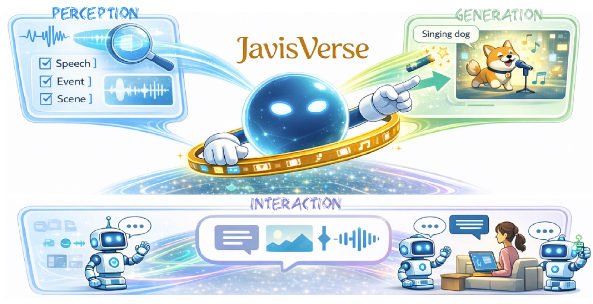
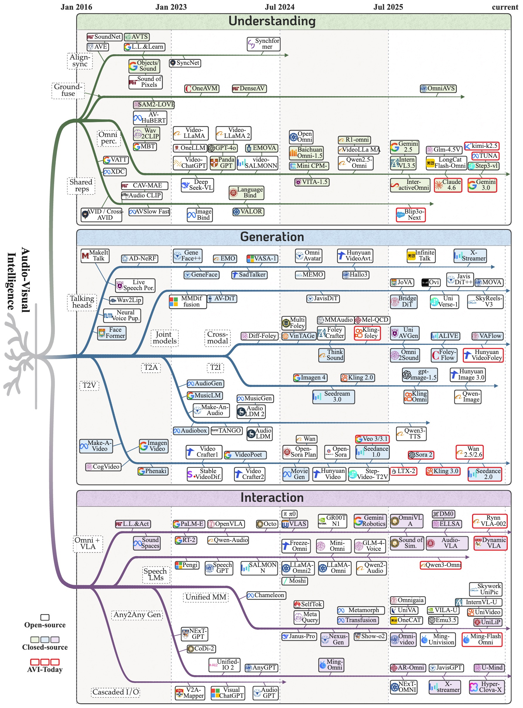

<h2 align="center">Audio-Visual Intelligence in Large Foundation Models: A Comprehensive Survey</h2>
<div align="center">

[](https://arxiv.org/abs/2605.04045)
[](https://github.com/JavisVerse/Awesome-AVI/issues/3)
[](https://github.com/JavisVerse/Awesome-AVI/discussions)
[](https://github.com/JavisVerse/Awesome-AVI/issues/4)
[](https://discord.gg/qdqRs5xhU)

</div>

> 💡 *This repository contains a curated list of papers and resources for Audio-Visual Intelligence (AVI), organized following our comprehensive survey.*
> 📌 *Please feel free to open an issue or PR for any possibly missed related work.*

<p align="center">
  
</p>

# 🎇 Introduction

Audio-Visual Intelligence (AVI) studies how machines can jointly perceive, generate, and interact with the world through sight and sound. In the era of large foundation models, AVI has rapidly evolved from task-specific alignment to unified omni-modal systems that integrate perception, generation, and embodied interaction within a single framework.

This survey provides the first systematic and in-depth treatment of AVI within the foundation-model paradigm, organizing the landscape around three interconnected pillars: **perception**, **generation**, and **interaction**. We consolidate the methodological foundations and review representative methods, datasets, and benchmarks across task families.

<p align="center">
  
</p>

---

### 🔥 Updates
> 2026-05-05: We release the **Awesome-AVI repo**.

---

# 📕 Table of Contents

- [🔧 Foundation Techniques](#🔧-foundation-techniques)
  - [Representation-Centric Methods](#representation-centric-methods)
  - [Generation-Centric Methods](#generation-centric-methods)
  - [LLM-Centric Methods](#llm-centric-methods)
- [👁️ Audio-Visual Perception](#👁️-audio-visual-perception)
  - [Audio-Visual Pixel Perception](#audio-visual-pixel-perception)
  - [Audio-Visual Content Understanding](#audio-visual-content-understanding)
  - [Audio-Visual Logical Reasoning](#audio-visual-logical-reasoning)
- [🎨 Audio-Visual Generation](#🎨-audio-visual-generation)
  - [Conditional Audio/Visual Generation](#conditional-audiovisual-generation)
  - [Audio-Visual Cross-Modal Generation](#audio-visual-cross-modal-generation)
  - [Joint Audio-Visual Generation](#joint-audio-visual-generation)
- [🤝 Audio-Visual Interaction](#🤝-audio-visual-interaction)
  - [Interactive Audio-Visual Conversation](#interactive-audio-visual-conversation)
  - [Interactive Audio-Visual Embodiment](#interactive-audio-visual-embodiment)
<!-- - [❤️ Citation](#%EF%B8%8F-citation)
- [⭐️ Star History](#%EF%B8%8F-star-history) -->

---

# 🔧 Foundation Techniques

This section introduces foundational techniques developed in the era of large foundation models, which provide key technical pathways toward achieving universal audio-visual intelligence, including **representation-centric**, **generation-centric**, and **LLM-centric** methods.

## Representation-Centric Methods

### Audio-Visual Feature Extraction and Representation

+ [**Look, listen and learn**](https://arxiv.org/abs/1705.08168) []()  <!-- 10-17 -->
+ [**Cooperative learning of audio and video models from self-supervised synchronization**](https://arxiv.org/abs/1807.00230) []()  <!-- 05-18 -->
+ [**Self-supervised learning by cross-modal audio-video clustering**](https://arxiv.org/abs/2004.02186) []() [](https://github.com/HumamAlwassel/XDC) <!-- 04-20 -->
+ [**Audio-visual instance discrimination with cross-modal agreement**](https://arxiv.org/abs/2004.12943) []() [](https://github.com/facebookresearch/AVID-CMA) <!-- 06-20 -->
+ [**Vatt: Transformers for multimodal self-supervised learning from raw video, audio and text**](https://arxiv.org/abs/2104.11178) []() [](https://github.com/google-research/google-research/tree/master/vatt) <!-- 04-21 -->
+ [**Es3: Evolving self-supervised learning of robust audio-visual speech representations**](https://openaccess.thecvf.com/content/CVPR2024/papers/Zhang_ES3_Evolving_Self-Supervised_Learning_of_Robust_Audio-Visual_Speech_Representations_CVPR_2024_paper.pdf) []()  <!-- 03-24 -->
+ [**Wav2clip: Learning robust audio representations from clip**](https://arxiv.org/abs/2110.11499) []() [](https://github.com/descriptinc/lyrebird-wav2clip)  <!-- 05-22 -->
+ [**Imagebind: One embedding space to bind them all**](https://arxiv.org/abs/2305.05665) []() [](https://github.com/facebookresearch/ImageBind)  <!-- 05-23 -->
+ [**EquiAV: leveraging equivariance for audio-visual contrastive learning**](https://arxiv.org/abs/2403.09502) []() [](https://github.com/JongSuk1/EquiAV)  <!-- 03-24 -->
+ [**Sequential contrastive audio-visual learning**](https://arxiv.org/abs/2407.05782) []()  <!-- 07-24 -->
+ [**MAViL: masked audio-video learners**](https://arxiv.org/abs/2212.08071) []() [](https://github.com/facebookresearch/MAViL)  <!-- 12-22 -->
+ [**Self-supervised audio-visual representation learning with relaxed cross-modal synchronicity**](https://arxiv.org/abs/2111.05329) []() [](https://github.com/pritamqu/CrissCross)  <!-- 01-23 -->
+ [**Cross-modal label contrastive learning for unsupervised audio-visual event localization**](https://ojs.aaai.org/index.php/AAAI/article/view/25093) []()  <!-- 04-23 -->
+ [**Attention bottlenecks for multimodal fusion**](https://arxiv.org/abs/2107.00135) []() [](https://github.com/google-research/scenic/tree/main/scenic/projects/mbt) <!-- 07-21 -->
+ [**Improving audio-visual segmentation with bidirectional generation**](https://arxiv.org/abs/2308.08288) []() [](https://github.com/OpenNLPLab/AVS-bidirectional)  <!-- 03-24 -->
+ [**Learning audio-visual speech representation by masked multimodal cluster prediction**](https://arxiv.org/abs/2201.02184) []() [](https://github.com/facebookresearch/av_hubert)  <!-- 01-22 -->
+ [**AVF-MAE++: Scaling Affective Video Facial Masked Autoencoders via Efficient Audio-Visual Self-Supervised Learning**](https://openaccess.thecvf.com/content/CVPR2025/html/Wu_AVF-MAE_Scaling_Affective_Video_Facial_Masked_Autoencoders_via_Efficient_Audio-Visual_CVPR_2025_paper.html) []() [](https://github.com/XuecWu/AVF-MAE)  <!-- 09-25 -->

### Audio-Visual Variational Auto-Encoding and Reconstruction

+ [**Auto-encoding variational bayes**](https://arxiv.org/abs/1312.6114) []()  <!-- 12-13 -->
+ [**Stochastic backpropagation and approximate inference in deep generative models**](https://arxiv.org/abs/1401.4082) []() <!-- 01-14 -->
+ [**Multimodal Variational Autoencoder: A Barycentric View**](https://arxiv.org/abs/2412.20487) []()  <!-- 04-25 -->
+ [**A multimodal dynamical variational autoencoder for audiovisual speech representation learning**](https://arxiv.org/abs/2305.03582) []() [](https://github.com/samsad35/code-mdvae)  <!-- 05-24 -->

### Audio-Visual Discrete Tokenization

+ [**Soundstream: An end-to-end neural audio codec**](https://arxiv.org/abs/2107.03312) []()  <!-- 07-21 -->
+ [**Neural discrete representation learning**](https://arxiv.org/abs/1711.00937) []()  <!-- 11-17 -->
+ [**High Fidelity Neural Audio Compression**](https://arxiv.org/abs/2210.13438) []() [](https://github.com/facebookresearch/encodec)  <!-- 06-24 -->
+ [**High-fidelity audio compression with improved rvqgan**](https://arxiv.org/abs/2306.06546) []() [](https://github.com/descriptinc/descript-audio-codec)  <!-- 06-23 -->
+ [**WavTokenizer: an Efficient Acoustic Discrete Codec Tokenizer for Audio Language Modeling**](https://arxiv.org/abs/2408.16532) []() [](https://github.com/jishengpeng/WavTokenizer)  <!-- 07-24 -->
+ [**Hubert: Self-supervised speech representation learning by masked prediction of hidden units**](https://arxiv.org/abs/2106.07447) []()  <!-- 06-21 -->
+ [**Codec does matter: Exploring the semantic shortcoming of codec for audio language model**](https://arxiv.org/abs/2408.17175) []()  <!-- 03-25 -->
+ [**Spark-TTS: An Efficient LLM-Based Text-to-Speech Model with Single-Stream Decoupled Speech Tokens**](https://arxiv.org/abs/2503.01710) []() [](https://github.com/SparkAudio/Spark-TTS)  <!-- 03-25 -->
+ [**Moshi: a speech-text foundation model for real-time dialogue**](https://arxiv.org/abs/2410.00037) []() [](https://github.com/kyutai-labs/moshi)  <!-- 10-24 -->
+ [**Taming Transformers for High-Resolution Image Synthesis**](https://arxiv.org/abs/2012.09841) []() [](https://github.com/CompVis/taming-transformers)  <!-- 12-20 -->
+ [**Language Model Beats Diffusion--Tokenizer is Key to Visual Generation**](https://arxiv.org/abs/2310.05737) []()  <!-- 10-23 -->
+ [**Scaling the Codebook Size of VQGAN to 100,000 with a Utilization Rate of 99\%**](https://arxiv.org/abs/2406.11837) []() [](https://github.com/zh460045050/VQGAN-LC)  <!-- 05-24 -->
+ [**Addressing representation collapse in vector quantized models with one linear layer**](https://arxiv.org/abs/2411.02038) []() [](https://github.com/youngsheen/SimVQ)  <!-- 05-24 -->
+ [**Tokenflow: Unified image tokenizer for multimodal understanding and generation**](https://arxiv.org/abs/2412.03069) []() [](https://github.com/ByteFlow-AI/TokenFlow)  <!-- 03-25 -->
+ [**Divot: Diffusion Powers Video Tokenizer for Comprehension and Generation**](https://arxiv.org/abs/2412.04432) []() [](https://github.com/TencentARC/Divot)  <!-- 03-25 -->
+ [**Speechgpt: Empowering large language models with intrinsic cross-modal conversational abilities**](https://arxiv.org/abs/2305.11000) []() [](https://github.com/0nutation/SpeechGPT)  <!-- 05-23 -->
+ [**AnyGPT: Unified Multimodal LLM with Discrete Sequence Modeling**](https://arxiv.org/abs/2402.12226) []() [](https://github.com/OpenMOSS/AnyGPT)  <!-- 02-24 -->

## Generation-Centric Methods

### Generative Adversarial Networks

+ [**Generative adversarial nets**](https://arxiv.org/abs/1406.2661) []()  <!-- 06-14 -->
+ [**Unsupervised representation learning with deep convolutional generative adversarial networks**](https://arxiv.org/abs/1511.06434) []()  <!-- 11-15 -->
+ [**Wasserstein GAN**](https://arxiv.org/abs/1701.07875) []() <!-- 01-17 -->
+ [**A style-based generator architecture for generative adversarial networks**](https://arxiv.org/abs/1812.04948) []()  <!-- 12-18 -->
+ [**Denoising diffusion probabilistic models**](https://arxiv.org/abs/2006.11239) []() [](https://github.com/hojonathanho/diffusion)  <!-- 06-20 -->
+ [**High-resolution image synthesis with latent diffusion models**](https://arxiv.org/abs/2112.10752) []() [](https://github.com/CompVis/latent-diffusion)  <!-- 12-21 -->
+ [**Generative adversarial text to image synthesis**](https://arxiv.org/abs/1605.05396) []() [](https://github.com/reedscot/icml2016) <!-- 06-16 -->
+ [**Mocogan: Decomposing motion and content for video generation**](https://arxiv.org/abs/1707.04993) []() [](https://github.com/sergeytulyakov/mocogan) <!-- 04-18 -->
+ [**Melgan: Generative adversarial networks for conditional waveform synthesis**](https://arxiv.org/abs/1910.06711) []()  <!-- 10-19 -->
+ [**Hifi-gan: Generative adversarial networks for efficient and high fidelity speech synthesis**](https://arxiv.org/abs/2010.05646) []() [](https://github.com/jik876/hifi-gan)  <!-- 10-20 -->
+ [**A lip sync expert is all you need for speech to lip generation in the wild**](https://arxiv.org/abs/2008.10010) []() [](https://github.com/Rudrabha/Wav2Lip)  <!-- 08-20 -->
+ [**Dancing to music**](https://arxiv.org/abs/1911.02001) []()  <!-- 11-19 -->
+ [**Visually indicated sounds**](https://arxiv.org/abs/1512.08512) []()  <!-- 12-15 -->
+ [**Visual to sound: Generating natural sound for videos in the wild**](https://arxiv.org/abs/1712.01393) []()  <!-- 12-17 -->
+ [**Align your latents: High-resolution video synthesis with latent diffusion models**](https://arxiv.org/abs/2304.08818) []()  <!-- 04-23 -->

### Diffusion-based Generation

+ [**Deep Unsupervised Learning Using Nonequilibrium Thermodynamics**](https://arxiv.org/abs/1503.03585) []()  <!-- 03-15 -->
+ [**Denoising diffusion probabilistic models**](https://arxiv.org/abs/2006.11239) []() [](https://github.com/hojonathanho/diffusion)  <!-- 06-20 -->
+ [**Flow Matching for Generative Modeling**](https://arxiv.org/abs/2210.02747) []()  <!-- 10-22 -->
+ [**Flow Straight and Fast: Learning to Generate and Transfer Data with Rectified Flow**](https://arxiv.org/abs/2209.03003) []() [](https://github.com/gnobitab/RectifiedFlow)  <!-- 09-22 -->
+ [**U-net: Convolutional networks for biomedical image segmentation**](https://arxiv.org/abs/1505.04597) []()  <!-- 05-15 -->
+ [**Scalable diffusion models with transformers**](https://arxiv.org/abs/2212.09748) []()  <!-- 12-22 -->
+ [**Scaling rectified flow transformers for high-resolution image synthesis**](https://arxiv.org/abs/2403.03206) []()  <!-- 03-24 -->
+ [**Hunyuanimage 3.0 technical report**](https://arxiv.org/abs/2509.23951) []() [](https://github.com/Tencent-Hunyuan/HunyuanImage-3.0)  <!-- 09-25 -->
+ [**Qwen-image technical report**](https://arxiv.org/abs/2508.02324) []() [](https://github.com/QwenLM/Qwen-Image)  <!-- 08-25 -->
+ [**Z-Image: An Efficient Image Generation Foundation Model with Single-Stream Diffusion Transformer**](https://arxiv.org/abs/2511.22699) []() [](https://github.com/Tongyi-MAI/Z-Image)  <!-- 11-25 -->
+ [**Hunyuanvideo: A systematic framework for large video generative models**](https://arxiv.org/abs/2412.03603) []() [](https://github.com/Tencent-Hunyuan/HunyuanVideo) <!-- 12-24 -->
+ [**Seedance 1.0: Exploring the Boundaries of Video Generation Models**](https://arxiv.org/abs/2506.09113) []()  <!-- 06-25 -->
+ [**Wan: Open and advanced large-scale video generative models**](https://arxiv.org/abs/2503.20314) []() [](https://github.com/Wan-Video/Wan2.1) [](https://huggingface.co/Wan-AI/Wan2.1-T2V-1.3B)  <!-- 03-25 -->
+ [**Seed-tts: A family of high-quality versatile speech generation models**](https://arxiv.org/abs/2406.02430) []() [](https://github.com/BytedanceSpeech/seed-tts-eval)  <!-- 06-24 -->
+ [**Audioldm 2: Learning holistic audio generation with self-supervised pretraining**](https://arxiv.org/abs/2308.05734) []() [](https://github.com/haoheliu/audioldm2)  <!-- 05-23 -->
+ [**Wan-s2v: Audio-driven cinematic video generation**](https://arxiv.org/abs/2508.18621) []() [](https://github.com/Wan-Video/Wan2.2) [](https://huggingface.co/Wan-AI/Wan2.2-S2V-14B)  <!-- 08-25 -->
+ [**MMAudio: Taming Multimodal Joint Training for High-Quality Video-to-Audio Synthesis**](https://arxiv.org/abs/2503.07539) []() [](https://github.com/hkchengrex/MMAudio)  <!-- 03-25 -->
+ [**Ovi: Twin backbone cross-modal fusion for audio-video generation**](https://arxiv.org/abs/2510.01284) []() [](https://github.com/character-ai/Ovi)  <!-- 10-25 -->
+ [**One-step diffusion with distribution matching distillation**](https://arxiv.org/abs/2311.18828) []()  <!-- 10-23 -->

### Autoregressive Generation

+ [**Conditional image generation with pixelcnn decoders**](https://arxiv.org/abs/1606.05328) []()  <!-- 06-16 -->
+ [**Wavenet: A generative model for raw audio**](https://arxiv.org/abs/1609.03499) []()  <!-- 09-16 -->
+ [**Neural discrete representation learning**](https://arxiv.org/abs/1711.00937) []()  <!-- 11-17 -->
+ [**Soundstream: An end-to-end neural audio codec**](https://arxiv.org/abs/2107.03312) []()  <!-- 07-21 -->
+ [**High Fidelity Neural Audio Compression**](https://arxiv.org/abs/2210.13438) []() [](https://github.com/facebookresearch/encodec)  <!-- 06-24 -->
+ [**Visual autoregressive modeling: Scalable image generation via next-scale prediction**](https://arxiv.org/abs/2404.02905) []() [](https://github.com/FoundationVision/VAR)  <!-- 04-24 -->
+ [**Autoregressive model beats diffusion: Llama for scalable image generation**](https://arxiv.org/abs/2406.06525) []() [](https://github.com/FoundationVision/LlamaGen)  <!-- 06-24 -->
+ [**Emu3: Next-token prediction is all you need**](https://arxiv.org/abs/2409.18869) []() [](https://github.com/baaivision/emu3)  <!-- 09-24 -->
+ [**Emu3. 5: Native multimodal models are world learners**](https://arxiv.org/abs/2510.26583) []() [](https://github.com/baaivision/Emu3.5)  <!-- 10-25 -->
+ [**Autoregressive video generation without vector quantization**](https://arxiv.org/abs/2412.14169) []() [](https://github.com/baaivision/NOVA)  <!-- 12-24 -->
+ [**Audiolm: a language modeling approach to audio generation**](https://arxiv.org/abs/2209.03143) []() <!-- 09-22 --> [](https://huggingface.co/papers/2209.03143)
+ [**Musiclm: Generating music from text**](https://arxiv.org/abs/2301.11325) []() [](https://huggingface.co/papers/2301.11325)  <!-- 01-23 -->
+ [**Simple and controllable music generation**](https://arxiv.org/abs/2306.05284) []() [](https://github.com/facebookresearch/audiocraft) <!-- 01-23 -->
+ [**Vall-e 2: Neural codec language models are human parity zero-shot text to speech synthesizers**](https://arxiv.org/abs/2406.05370) []() [](https://huggingface.co/papers/2406.05370)  <!-- 06-24 -->
+ [**Cosyvoice 2: Scalable streaming speech synthesis with large language models**](https://arxiv.org/abs/2412.10117) []() [](https://github.com/FunAudioLLM/CosyVoice)  <!-- 12-24 -->
+ [**Language models are few-shot learners**](https://arxiv.org/abs/2005.14165) []()  <!-- 05-20 -->
+ [**VideoPoet: A Large Language Model for Zero-Shot Video Generation**](https://arxiv.org/abs/2312.14125) []()  <!-- 12-23 -->
+ [**Temporally Aligned Audio for Video with Autoregression**](https://arxiv.org/abs/2409.13689) []()  <!-- 09-24 -->

### Masked Autoregressive Generation

+ [**Mask-predict: Parallel decoding of conditional masked language models**](https://arxiv.org/abs/1904.09324) []()  <!-- 05-19 -->
+ [**MaskGIT: Masked Generative Image Transformer**](https://arxiv.org/abs/2202.04200) []()  <!-- 02-22 -->
+ [**Muse: Text-To-Image Generation via Masked Generative Transformers**](https://arxiv.org/abs/2301.00704) []()  <!-- 01-23 -->
+ [**MAGVIT: Masked Generative Video Transformer**](https://arxiv.org/abs/2212.05199) []()  <!-- 12-22 -->
+ [**Language Model Beats Diffusion--Tokenizer is Key to Visual Generation**](https://arxiv.org/abs/2310.05737) []()  <!-- 10-23 -->
+ [**Open-magvit2: An open-source project toward democratizing auto-regressive visual generation**](https://arxiv.org/abs/2409.04410) []() [](https://github.com/zmghub/Open-MAGVIT2)  <!-- 09-24 -->
+ [**MaskViT: Masked Visual Pre-Training for Video Prediction**](https://arxiv.org/abs/2206.11894) []()  <!-- 06-22 -->
+ [**Phenaki: Variable Length Video Generation From Open Domain Textual Description**](https://arxiv.org/abs/2210.02399) []()  <!-- 10-22 -->
+ [**SoundStorm: Efficient Parallel Audio Generation**](https://arxiv.org/abs/2305.09636) []()  <!-- 05-23 -->
+ [**Autoregressive image generation without vector quantization**](https://arxiv.org/abs/2406.11838) []() [](https://github.com/LTH14/mar)  <!-- 06-24 -->
+ [**Maskbit: Embedding-free image generation via bit tokens**](https://arxiv.org/abs/2409.16211) []() [](https://github.com/markweberdev/maskbit)  <!-- 09-24 -->

## LLM-Centric Methods

### Encoder+LLM for Multimodal Perception

+ [**Learning transferable visual models from natural language supervision**](https://arxiv.org/abs/2103.00020) []() [](https://github.com/OpenAI/CLIP)  <!-- 03-21 -->
+ [**Sigmoid loss for language image pre-training**](https://arxiv.org/abs/2303.15343) []() [](https://github.com/google-research/big_vision)  <!-- 03-23 -->
+ [**Qwen2. 5-vl technical report**](https://arxiv.org/abs/2502.13923) []() [](https://github.com/QwenLM/Qwen2.5-VL) <!-- 02-25 --> [](https://huggingface.co/Qwen/Qwen2.5-VL-72B-Instruct)
+ [**Flamingo: a visual language model for few-shot learning**](https://arxiv.org/abs/2204.14198) []() [](https://github.com/mlfoundations/open_flamingo)  <!-- 04-22 -->
+ [**Blip-2: Bootstrapping language-image pre-training with frozen image encoders and large language models**](https://arxiv.org/abs/2301.12597) []() [](https://github.com/salesforce/LAVIS)  <!-- 01-23 -->
+ [**MiniGPT-4: Enhancing Vision-Language Understanding with Advanced Large Language Models**](https://arxiv.org/abs/2304.10592) []() [](https://github.com/Vision-CAIR/MiniGPT-4)  <!-- 04-23 -->
+ [**Video-chatgpt: Towards detailed video understanding via large vision and language models**](https://arxiv.org/abs/2310.02913) []() [](https://github.com/mbzuai-oryx/Video-ChatGPT)  <!-- 10-23 -->
+ [**Video-llava: Learning united visual representation by alignment before projection**](https://arxiv.org/abs/2311.15106) []() [](https://github.com/OSU-NLP-Group/UMLS-Vocabulary-Insertion)  <!-- 11-23 -->
+ [**Video-LLaMA: An Instruction-tuned Audio-Visual Language Model for Video Understanding**](https://arxiv.org/abs/2305.13660) []() [](https://github.com/DAMO-NLP-SG/Video-LLaMA)  <!-- 05-23 -->
+ [**Llama-vid: An image is worth 2 tokens in large language models**](https://arxiv.org/abs/2311.17043) []() [](https://github.com/dvlab-research/LLaMA-VID) <!-- 05-24 -->
+ [**Qwen3-vl technical report**](https://arxiv.org/abs/2511.21631) []() [](https://github.com/QwenLM/Qwen3-VL) <!-- 11-25 --> [](https://huggingface.co/Qwen/Qwen3-VL-235B-A22B-Instruct)
+ [**Expanding performance boundaries of open-source multimodal models with model, data, and test-time scaling**](https://arxiv.org/abs/2412.05271) []() [](https://github.com/OpenGVLab/InternVL) [](https://huggingface.co/OpenGVLab/InternVL2_5-78B)  <!-- 12-24 -->
+ [**Internvl3. 5: Advancing open-source multimodal models in versatility, reasoning, and efficiency**](https://arxiv.org/abs/2508.18265) []() [](https://github.com/OpenGVLab/InternVL)  <!-- 08-25 -->
+ [**Long context transfer from language to vision**](https://arxiv.org/abs/2406.16852) []() [](https://github.com/EvolvingLMMs-Lab/LongVA)  <!-- 06-24 -->
+ [**Longvu: Spatiotemporal adaptive compression for long video-language understanding**](https://arxiv.org/abs/2410.17434) []() [](https://github.com/Vision-CAIR/LongVU)  <!-- 10-24 -->
+ [**An image is worth 1/2 tokens after layer 2: Plug-and-play inference acceleration for large vision-language models**](https://arxiv.org/abs/2403.01862) []()  <!-- 03-24 -->
+ [**Hubert: Self-supervised speech representation learning by masked prediction of hidden units**](https://arxiv.org/abs/2106.07447) []()  <!-- 06-21 -->
+ [**Speecht5: Unified-modal encoder-decoder pre-training for spoken language processing**](https://arxiv.org/abs/2110.07205) []() [](https://github.com/microsoft/SpeechT5)  <!-- 10-21 -->
+ [**BEATs: Audio Pre-Training with Acoustic Tokenizers**](https://arxiv.org/abs/2212.09078) []()  <!-- 12-22 -->
+ [**Robust speech recognition via large-scale weak supervision**](https://arxiv.org/abs/2212.04356) []()  <!-- 12-22 -->
+ [**Pengi: An audio language model for audio tasks**](https://arxiv.org/abs/2305.11834) []() [](https://github.com/microsoft/Pengi)  <!-- 05-23 -->
+ [**Llasm: Large language and speech model**](https://arxiv.org/abs/2308.15930) []() [](https://github.com/LinkSoul-AI/LLaSM)  <!-- 08-23 -->
+ [**Gama: A large audio-language model with advanced audio understanding and complex reasoning abilities**](https://arxiv.org/abs/2406.11768) []() [](https://github.com/Sreyan88/GAMA)  <!-- 06-24 -->
+ [**Salmonn: Towards generic hearing abilities for large language models**](https://arxiv.org/abs/2310.13289) []() [](https://github.com/bytedance/SALMONN)  <!-- 10-23 -->
+ [**Qwen-audio: Advancing universal audio understanding via unified large-scale audio-language models**](https://arxiv.org/abs/2311.07919) []() [](https://github.com/QwenLM/Qwen-Audio)  <!-- 11-23 -->
+ [**Qwen2-audio technical report**](https://arxiv.org/abs/2407.10759) []() [](https://github.com/QwenLM/Qwen2-Audio)  <!-- 07-24 -->
+ [**Videollama 2: Advancing spatial-temporal modeling and audio understanding in video-llms**](https://arxiv.org/abs/2406.07476) []() [](https://github.com/DAMO-NLP-SG/VideoLLaMA2)  <!-- 06-24 -->
+ [**Next-gpt: Any-to-any multimodal llm**](https://arxiv.org/abs/2309.05519) []() [](https://github.com/NExT-GPT/NExT-GPT) <!-- 09-24 -->
+ [**Onellm: One framework to align all modalities with language**](https://arxiv.org/abs/2312.06748) []() [](https://github.com/csuhan/OneLLM) <!-- 12-23 -->
+ [**AnyGPT: Unified Multimodal LLM with Discrete Sequence Modeling**](https://arxiv.org/abs/2402.12226) []() [](https://github.com/OpenMOSS/AnyGPT)  <!-- 02-24 -->
+ [**Vita-1.5: Towards gpt-4o level real-time vision and speech interaction**](https://arxiv.org/abs/2501.01957) []() [](https://github.com/VITA-MLLM/VITA)  <!-- 01-25 -->
+ [**Gpt-4o system card**](https://arxiv.org/abs/2410.21276) []() [](https://huggingface.co/papers/2410.21276)  <!-- 10-24 -->
+ [**Qwen2. 5-omni technical report**](https://arxiv.org/abs/2503.20215) []() [](https://github.com/QwenLM/Qwen2.5-Omni) <!-- 03-25 --> [](https://huggingface.co/Qwen/Qwen2.5-Omni-7B)
+ [**Ming-Omni: A Unified Multimodal Model for Perception and Generation**](https://arxiv.org/abs/2506.09344) []() [](https://github.com/inclusionAI/Ming/tree/main) <!-- 06-25 --> [](https://huggingface.co/inclusionAI/Ming-Lite-Omni-1.5)
+ [**Qwen3-omni technical report**](https://arxiv.org/abs/2509.17765) []() [](https://github.com/QwenLM/Qwen3-Omni) <!-- 09-25 --> [](https://huggingface.co/Qwen/Qwen3-Omni-30B-A3B-Instruct)

### LLM+Generator for Multimodal Generation

+ [**Visual chatgpt: Talking, drawing and editing with visual foundation models**](https://arxiv.org/abs/2303.04671) []() [](https://github.com/microsoft/visual-chatgpt)  <!-- 03-23 -->
+ [**Audiogpt: Understanding and generating speech, music, sound, and talking head**](https://arxiv.org/abs/2304.12995) []() [](https://github.com/AIGC-Audio/AudioGPT)  <!-- 04-23 -->
+ [**Audioldm: Text-to-audio generation with latent diffusion models**](https://arxiv.org/abs/2301.12503) []() [](https://github.com/haoheliu/audioldm_eval)  <!-- 01-23 -->
+ [**Next-gpt: Any-to-any multimodal llm**](https://arxiv.org/abs/2309.05519) []() [](https://github.com/NExT-GPT/NExT-GPT) <!-- 09-24 -->
+ [**Codi-2: In-context interleaved and interactive any-to-any generation**](https://arxiv.org/abs/2407.04822) []() [](https://github.com/mimbres/YourMT3)  <!-- 07-24 -->
+ [**Javisgpt: A unified multi-modal llm for sounding-video comprehension and generation**](https://arxiv.org/abs/2512.22905) []() [](https://github.com/JavisVerse/JavisGPT)  <!-- 12-25 -->
+ [**A2-LLM: An End-to-end Conversational Audio Avatar Large Language Model**](https://arxiv.org/abs/2602.04913) []()  <!-- 02-26 -->
+ [**Qwen-image technical report**](https://arxiv.org/abs/2508.02324) []() [](https://github.com/QwenLM/Qwen-Image)  <!-- 08-25 -->
+ [**Univideo: Unified understanding, generation, and editing for videos**](https://arxiv.org/abs/2510.08377) []() [](https://github.com/KlingAIResearch/UniVideo) <!-- 10-25 -->

### Unified Model for Joint Perception and Generation

+ [**Gpt-4o system card**](https://arxiv.org/abs/2410.21276) []() [](https://huggingface.co/papers/2410.21276)  <!-- 10-24 -->
+ [**Qwen2. 5-omni technical report**](https://arxiv.org/abs/2503.20215) []() [](https://github.com/QwenLM/Qwen2.5-Omni) <!-- 03-25 --> [](https://huggingface.co/Qwen/Qwen2.5-Omni-7B)
+ [**Mini-omni: Language models can hear, talk while thinking in streaming**](https://arxiv.org/abs/2408.16725) []() [](https://github.com/gpt-omni/mini-omni)  <!-- 08-24 -->
+ [**Interactiveomni: A unified omni-modal model for audio-visual multi-turn dialogue**](https://arxiv.org/abs/2510.13747) []() [](https://github.com/SenseTime-FVG/InteractiveOmni) <!-- 10-25 --> [](https://github.com/OpenSenseNova/InteractiveOmni)
+ [**Moshi: a speech-text foundation model for real-time dialogue**](https://arxiv.org/abs/2410.00037) []() [](https://github.com/kyutai-labs/moshi)  <!-- 10-24 -->
+ [**Qwen3-omni technical report**](https://arxiv.org/abs/2509.17765) []() [](https://github.com/QwenLM/Qwen3-Omni) <!-- 09-25 --> [](https://huggingface.co/Qwen/Qwen3-Omni-30B-A3B-Instruct)
+ [**Emu: Generative pretraining in multimodality**](https://arxiv.org/abs/2307.05222) []() [](https://github.com/baaivision/Emu)  <!-- 07-23 -->
+ [**Dreamllm: Synergistic multimodal comprehension and creation**](https://arxiv.org/abs/2309.11499) []()  <!-- 09-23 -->
+ [**Janus: Decoupling visual encoding for unified multimodal understanding and generation**](https://arxiv.org/abs/2410.13848) []()  <!-- 10-24 -->
+ [**Chameleon: Mixed-Modal Early-Fusion Foundation Models**](https://arxiv.org/abs/2405.09818) []() [](https://github.com/facebookresearch/chameleon)  <!-- 05-24 -->
+ [**Show-o: One Single Transformer to Unify Multimodal Understanding and Generation**](https://arxiv.org/abs/2408.12528) []() [](https://github.com/showlab/Show-o)  <!-- 08-24 -->
+ [**Janus-pro: Unified multimodal understanding and generation with data and model scaling**](https://arxiv.org/abs/2501.17811) []() [](https://github.com/deepseek-ai/Janus) [](https://huggingface.co/deepseek-ai/Janus-Pro-7B)  <!-- 01-25 -->
+ [**Emerging properties in unified multimodal pretraining**](https://arxiv.org/abs/2505.14683) []() [](https://github.com/bytedance-seed/BAGEL) [](https://huggingface.co/ByteDance-Seed/BAGEL-7B-MoT)  <!-- 05-25 -->
+ [**Emu3: Next-token prediction is all you need**](https://arxiv.org/abs/2409.18869) []() [](https://github.com/baaivision/emu3)  <!-- 09-24 -->
+ [**Transfusion: Predict the next token and diffuse images with one multi-modal model**](https://arxiv.org/abs/2408.11039) []() [](https://huggingface.co/papers/2408.11039)  <!-- 08-24 -->
+ [**VideoPoet: A Large Language Model for Zero-Shot Video Generation**](https://arxiv.org/abs/2312.14125) []()  <!-- 12-23 -->
+ [**Javisgpt: A unified multi-modal llm for sounding-video comprehension and generation**](https://arxiv.org/abs/2512.22905) []() [](https://github.com/JavisVerse/JavisGPT)  <!-- 12-25 -->
+ [**Object-AVEdit: An Object-level Audio-Visual Editing Model**](https://arxiv.org/abs/2510.00050) []() [](https://github.com/F-youquan/Object-AVEdit)  <!-- 10-25 -->

### Agentic System for Interactive Perception and Generation

+ [**Hugginggpt: Solving ai tasks with chatgpt and its friends in hugging face**](https://arxiv.org/abs/2303.17580) []()  <!-- 03-23 -->
+ [**DoraemonGPT: Toward Understanding Dynamic Scenes with Large Language Models (Exemplified as A Video Agent)**](https://arxiv.org/abs/2407.10809) []() [](https://github.com/z-x-yang/DoraemonGPT)  <!-- 07-24 -->
+ [**VCA: Video Curious Agent for Long Video Understanding**](https://arxiv.org/abs/2412.10471) []() [](https://huggingface.co/papers/2412.10471)  <!-- 12-24 -->
+ [**V-Stylist: Video Stylization via Collaboration and Reflection of MLLM Agents**](https://arxiv.org/abs/2503.12077) []() [](https://huggingface.co/papers/2503.12077)  <!-- 03-25 -->
+ [**Preacher: Paper-to-Video Agentic System**](https://arxiv.org/abs/2508.09632) []() [](https://github.com/Gen-Verse/Paper2Video)  <!-- 08-25 -->
+ [**Audio-Agent: Leveraging LLMs For Audio Generation, Editing and Composition**](https://arxiv.org/abs/2410.03335) []()  <!-- 10-24 -->
+ [**Audiotoolagent: An agentic framework for audio-language models**](https://arxiv.org/abs/2510.02995) []() [](https://github.com/GLJS/AudioToolAgent)  <!-- 10-25 -->

### Visual-Language-Action Models for Embodied Interaction

+ [**Rt-2: Vision-language-action models transfer web knowledge to robotic control**](https://arxiv.org/abs/2307.15818) []()  <!-- 07-23 -->
+ [**RT-H: Action Hierarchies using Language**](https://arxiv.org/abs/2403.01823) []() <!-- 03-24 -->
+ [**RT-Trajectory: Robotic Task Generalization via Hindsight Trajectory Sketches**](https://arxiv.org/abs/2311.01977) []() <!-- 10-23 -->
+ [**OpenVLA: An Open-Source Vision-Language-Action Model**](https://arxiv.org/abs/2406.09246) []() [](https://github.com/openvla/openvla) [](https://huggingface.co/openvla/openvla-v01-7b)  <!-- 06-24 -->
+ [**Tinyvla: Towards fast, data-efficient vision-language-action models for robotic manipulation**](https://arxiv.org/abs/2409.12514) []() [](https://github.com/JayceWen/tinyvla) <!-- 06-24 -->
+ [**Smolvla: A vision-language-action model for affordable and efficient robotics**](https://arxiv.org/abs/2506.01844) []() [](https://github.com/huggingface/lerobot)  <!-- 06-25 -->
+ [**Gr00t n1: An open foundation model for generalist humanoid robots**](https://arxiv.org/abs/2503.14734) []() [](https://github.com/NVIDIA/Isaac-GR00T) [](https://huggingface.co/nvidia/GR00T-N1-2B)  <!-- 03-25 -->
+ [**Gemini robotics: Bringing ai into the physical world**](https://arxiv.org/abs/2503.20020) []()  <!-- 03-25 -->
+ [**$\pi_0$: A Vision-Language-Action Flow Model for General Robot Control**](https://arxiv.org/abs/2410.24164) []() [](https://github.com/Physical-Intelligence/openpi) [](https://huggingface.co/collections/lerobot/pi0-67b4c0a0e0dd6645220a9652)  <!-- 10-24 -->
+ [**Octo: An open-source generalist robot policy**](https://arxiv.org/abs/2405.12213) []() [](https://github.com/octo-models/octo)  <!-- 05-24 -->
+ [**Graspvla: a grasping foundation model pre-trained on billion-scale synthetic action data**](https://arxiv.org/abs/2505.03233) []() [](https://github.com/PKU-EPIC/GraspVLA)  <!-- 05-25 -->
+ [**Tracevla: Visual trace prompting enhances spatial-temporal awareness for generalist robotic policies**](https://arxiv.org/abs/2412.10345) []() [](https://github.com/umd-huang-lab/tracevla)  <!-- 12-24 -->
+ [**Cogact: A foundational vision-language-action model for synergizing cognition and action in robotic manipulation**](https://arxiv.org/abs/2411.19650) []() [](https://github.com/microsoft/CogACT) [](https://huggingface.co/CogACT/CogACT-Large)  <!-- 11-24 -->
+ [**Cogvla: Cognition-aligned vision-language-action model via instruction-driven routing \& sparsification**](https://arxiv.org/abs/2508.21046) []() [](https://github.com/JiuTian-VL/CogVLA)  <!-- 08-25 -->
+ [**Failsafe: Reasoning and recovery from failures in vision-language-action models**](https://arxiv.org/abs/2510.01642) []() [](https://github.com/Jimntu/FailSafe_code)  <!-- 10-25 -->
+ [**RynnVLA-002: A Unified Vision-Language-Action and World Model**](https://arxiv.org/abs/2511.17502) []() [](https://huggingface.co/Alibaba-DAMO-Academy/RynnVLA-002)  <!-- 11-25 -->

---

# 👁️ Audio-Visual Perception

Perception in audio-visual systems begins with *what* can be read off raw signals, then moves to *what* those signals mean in context, and finally to *why* and *how* events are related over time. This section covers pixel-level perception, content understanding, and logical reasoning.

## Audio-Visual Pixel Perception

### Audio Perception

+ [**Hubert: Self-supervised speech representation learning by masked prediction of hidden units**](https://arxiv.org/abs/2106.07447) []()  <!-- 06-21 -->
+ [**BEATs: Audio Pre-Training with Acoustic Tokenizers**](https://arxiv.org/abs/2212.09078) []()  <!-- 12-22 -->
+ [**MERT: Acoustic Music Understanding Model with Large-Scale Self-supervised Training**](https://arxiv.org/abs/2306.00109) []() [](https://github.com/yizhilll/MERT) [](https://huggingface.co/m-a-p/MERT-v1-95M)  <!-- 06-23 -->
+ [**Muq: Self-supervised music representation learning with mel residual vector quantization**](https://arxiv.org/abs/2501.01108) []() [](https://github.com/tencent-ailab/MuQ)  <!-- 01-25 -->
+ [**Speechprompt v2: Prompt tuning for speech classification tasks**](https://arxiv.org/abs/2303.00733) []()  <!-- 03-23 -->
+ [**Mulan: A joint embedding of music audio and natural language**](https://arxiv.org/abs/2208.12415) []()  <!-- 08-22 -->
+ [**Training sound event detection with soft labels from crowdsourced annotations**](https://arxiv.org/abs/2302.09712) []()  <!-- 02-23 -->
+ [**Svad: A robust, low-power, and light-weight voice activity detection with spiking neural networks**](https://arxiv.org/abs/2403.05772) []() <!-- 08-24 -->
+ [**Fine-tune the pretrained ATST model for sound event detection**](https://arxiv.org/abs/2402.01566) []()  <!-- 02-24 -->
+ [**Beat Transformer: Demixed Beat and Downbeat Tracking with Dilated Self-Attention**](https://arxiv.org/abs/2110.04071) []()  <!-- 10-21 -->
+ [**CMI-Bench: A Comprehensive Benchmark for Evaluating Music Instruction Following**](https://arxiv.org/abs/2506.12285) []()  <!-- 06-25 -->
+ [**TF-GridNet: Making time-frequency domain models great again for monaural speaker separation**](https://arxiv.org/abs/2209.03952) []() <!-- 09-22 --> [](https://github.com/espnet/espnet)
+ [**Dual-path mamba: Short and long-term bidirectional selective structured state space models for speech separation**](https://arxiv.org/abs/2403.18257) []() [](https://github.com/xi-j/Mamba-TasNet) <!-- 12-24 -->
+ [**Hybrid transformers for music source separation**](https://arxiv.org/abs/2309.02612) []() [](https://github.com/pamudu123/HTDemucs) [](https://github.com/facebookresearch/demucs)  <!-- 09-23 -->
+ [**Music source separation with band-split RNN**](https://arxiv.org/abs/2209.15174) []() [](https://github.com/amanteur/BandSplitRNN-PyTorch)  <!-- 09-22 -->

### Visual Perception

+ [**Faster R-CNN: Towards real-time object detection with region proposal networks**](https://arxiv.org/abs/1506.01497) []() [](https://github.com/rbgirshick/py-faster-rcnn)  <!-- 06-15 -->
+ [**Deformable detr: Deformable transformers for end-to-end object detection**](https://arxiv.org/abs/2010.04159) []() [](https://github.com/fundamentalvision/Deformable-DETR)  <!-- 10-20 -->
+ [**Scaling open-vocabulary object detection**](https://arxiv.org/abs/2306.09683) []() <!-- 06-23 --> [](https://github.com/google-research/scenic)
+ [**Glipv2: Unifying localization and vision-language understanding**](https://arxiv.org/abs/2206.05836) []() [](https://github.com/microsoft/GLIP)  <!-- 06-22 -->
+ [**Grounding dino: Marrying dino with grounded pre-training for open-set object detection**](https://arxiv.org/abs/2303.05499) []() [](https://github.com/IDEA-Research/GroundingDINO)  <!-- 04-23 -->
+ [**Next-chat: An lmm for chat, detection and segmentation**](https://arxiv.org/abs/2311.04498) []() [](https://github.com/NExT-ChatV/NExT-Chat)  <!-- 11-23 -->
+ [**Panoptic segmentation**](https://arxiv.org/abs/1801.00868) []() [](https://github.com/facebookresearch/detectron2)  <!-- 01-18 -->
+ [**Masked-attention mask transformer for universal image segmentation**](https://arxiv.org/abs/2112.01527) []() [](https://github.com/facebookresearch/Mask2Former)  <!-- 12-21 -->
+ [**Segment anything**](https://arxiv.org/abs/2304.02643) []() [](https://github.com/facebookresearch/segment-anything)  <!-- 04-23 -->
+ [**Sam 2: Segment anything in images and videos**](https://arxiv.org/abs/2408.00714) []() [](https://github.com/facebookresearch/sam2)  <!-- 08-24 -->
+ [**Sam 3: Segment anything with concepts**](https://arxiv.org/abs/2511.16719) []() [](https://github.com/facebookresearch/sam3) <!-- 11-25 -->
+ [**Sutrack: Towards simple and unified single object tracking**](https://arxiv.org/abs/2412.19138) []() [](https://github.com/chenxin-dlut/SUTrack) <!-- 03-25 -->
+ [**Bytetrack: Multi-object tracking by associating every detection box**](https://arxiv.org/abs/2110.06864) []() [](https://github.com/ifzhang/ByteTrack)  <!-- 10-21 -->
+ [**Track anything: Segment anything meets videos**](https://arxiv.org/abs/2304.11968) []() [](https://github.com/gaomingqi/Track-Anything) <!-- 04-23 -->
+ [**Follow anything: Open-set detection, tracking, and following in real-time**](https://arxiv.org/abs/2308.05737) []() [](https://github.com/alaamaalouf/FollowAnything) <!-- 05-23 -->
+ [**An empirical study of end-to-end temporal action detection**](https://arxiv.org/abs/2204.03454) []() [](https://github.com/MCG-NJU/BasicTAD)  <!-- 04-22 -->
+ [**Tridet: Temporal action detection with relative boundary modeling**](https://arxiv.org/abs/2303.12042) []() [](https://github.com/dingfengshi/TriDet)  <!-- 03-23 -->
+ [**End-to-end temporal action detection with transformer**](https://arxiv.org/abs/2203.16046) []() [](https://github.com/MCG-NJU/RTD-Action)  <!-- 03-22 -->
+ [**Actionformer: Localizing moments of actions with transformers**](https://arxiv.org/abs/2202.07925) []() [](https://github.com/happyharrycn/actionformer_release)  <!-- 07-22 -->

### Audio-Visual Event Localization/Grounding

+ [**Audio-visual event localization in unconstrained videos**](https://arxiv.org/abs/1804.03947) []() <!-- 04-18 --> [](https://github.com/YapengTian/AVE-ECCV18)
+ [**The sound of pixels**](https://arxiv.org/abs/1804.03160) []() [](https://github.com/hangzhaomit/Sound-of-Pixels)  <!-- 04-18 -->
+ [**Cross-modal relation-aware networks for audio-visual event localization**](https://arxiv.org/abs/2007.09114) []() <!-- 07-20 -->
+ [**Dual attention matching for audio-visual event localization**](https://arxiv.org/abs/1907.04401) []()  <!-- 07-19 -->
+ [**Dual-modality seq2seq network for audio-visual event localization**](https://arxiv.org/abs/1907.05068) []() <!-- 07-19 -->
+ [**Positive sample propagation along the audio-visual event line**](https://arxiv.org/abs/2104.00234) []() <!-- 04-21 -->
+ [**Dual perspective network for audio-visual event localization**](https://arxiv.org/abs/2205.09510) []()  <!-- 05-22 -->
+ [**Unified multisensory perception: Weakly-supervised audio-visual video parsing**](https://arxiv.org/abs/2007.10539) []() <!-- 07-20 --> [](https://github.com/YapengTian/AVVP-ECCV20)
+ [**Ave-clip: Audioclip-based multi-window temporal transformer for audio visual event localization**](https://arxiv.org/abs/2307.01146) []() [](https://github.com/vvvb-github/AVSegFormer)  <!-- 07-23 -->
+ [**Vision transformers are parameter-efficient audio-visual learners**](https://arxiv.org/abs/2210.06969) []() <!-- 10-22 --> [](https://github.com/GenjiB/LAVISH)
+ [**Towards efficient audio-visual learners via empowering pre-trained vision transformers with cross-modal adaptation**](https://arxiv.org/abs/2403.01862) []()  <!-- 03-24 -->
+ [**Prompt Image to Watch and Hear: Multimodal Prompting for Parameter-Efficient Audio-Visual Learning**](https://bmva-archive.org.uk/bmvc/2025/assets/papers/Paper_949/paper.pdf) []()
+ [**OpenAVE: Moving towards open set audio-visual event localization**](https://arxiv.org/abs/2407.04822) []() [](https://github.com/mimbres/YourMT3)  <!-- 07-24 -->
+ [**Towards open-vocabulary audio-visual event localization**](https://arxiv.org/abs/2411.11278) []()  <!-- 03-24 -->
+ [**Dense-localizing audio-visual events in untrimmed videos: A large-scale benchmark and baseline**](https://arxiv.org/abs/2303.12930) []()  <!-- 03-23 -->
+ [**Dense audio-visual event localization under cross-modal consistency and multi-temporal granularity collaboration**](https://arxiv.org/abs/2307.06451) []() [](https://github.com/zzhhfut/CCNet-AAAI2025)  <!-- 07-23 -->

### Audio-Visual Segmentation

+ [**Audio--visual segmentation**](https://arxiv.org/abs/2206.09671) []() <!-- 06-22 --> [](https://github.com/OpenNLPLab/AVSBench)
+ [**Audio-visual segmentation with semantics**](https://arxiv.org/abs/2501.02367) []() <!-- 01-25 --> [](https://github.com/OpenNLPLab/AVSBench)
+ [**Robust Audio-Visual Segmentation via Audio-Guided Visual Convergent Alignment**](https://arxiv.org/abs/2503.12847) []()  <!-- 03-24 -->
+ [**Dynamic Derivation and Elimination: Audio Visual Segmentation with Enhanced Audio Semantics**](https://arxiv.org/abs/2503.12840) []() [](https://github.com/YenanLiu/DDESeg)  <!-- 03-24 -->
+ [**Weakly-supervised audio-visual segmentation**](https://arxiv.org/abs/2305.12431) []() <!-- 05-23 --> [](https://huggingface.co/papers/2307.00448)
+ [**Annotation-free audio-visual segmentation**](https://arxiv.org/abs/2305.12431) []() <!-- 05-23 --> [](https://github.com/jinxiang-liu/anno-free-AVS)
+ [**Unsupervised audio-visual segmentation with modality alignment**](https://arxiv.org/abs/2403.14203) []()  <!-- 03-24 -->
+ [**Segment anything**](https://arxiv.org/abs/2304.02643) []() [](https://github.com/facebookresearch/segment-anything)  <!-- 04-23 -->
+ [**DINOv2: Learning Robust Visual Features without Supervision**](https://arxiv.org/abs/2304.07193) []() [](https://github.com/facebookresearch/dinov2)  <!-- 04-23 -->
+ [**Qdformer: Towards robust audiovisual segmentation in complex environments with quantization-based semantic decomposition**](https://arxiv.org/abs/2310.00132) []() [](https://github.com/lxa9867/QSD)  <!-- 03-24 -->
+ [**Discovering sounding objects by audio queries for audio visual segmentation**](https://arxiv.org/abs/2305.12431) []()  <!-- 05-23 -->
+ [**Cpm: Class-conditional prompting machine for audio-visual segmentation**](https://arxiv.org/abs/2407.05358) []()  <!-- 03-24 -->
+ [**Avsegformer: Audio-visual segmentation with transformer**](https://arxiv.org/abs/2307.01146) []() [](https://github.com/vvvb-github/AVSegFormer)  <!-- 07-23 -->
+ [**Unveiling the power of audio-visual early fusion transformers with dense interactions through masked modeling**](https://arxiv.org/abs/2312.01017) []() [](https://github.com/stoneMo/DeepAVFusion)  <!-- 05-23 -->
+ [**Prompting segmentation with sound is generalizable audio-visual source localizer**](https://arxiv.org/abs/2401.00580) []() <!-- 01-24 -->
+ [**Cooperation does matter: Exploring multi-order bilateral relations for audio-visual segmentation**](https://arxiv.org/abs/2407.04822) []() [](https://github.com/mimbres/YourMT3)  <!-- 07-24 -->
+ [**Sam 2: Segment anything in images and videos**](https://arxiv.org/abs/2408.00714) []() [](https://github.com/facebookresearch/sam2)  <!-- 08-24 -->
+ [**Contrastive conditional latent diffusion for audio-visual segmentation**](https://arxiv.org/abs/2403.12117) []()  <!-- 03-24 -->
+ [**BAVS: bootstrapping audio-visual segmentation by integrating foundation knowledge**](https://arxiv.org/abs/2308.10175) []()  <!-- 03-24 -->
+ [**One transformer fits all distributions in multi-modal diffusion at scale**](https://arxiv.org/abs/2303.06555) []()  <!-- 03-23 -->
+ [**Can Textual Semantics Mitigate Sounding Object Segmentation Preference?**](https://arxiv.org/abs/2407.10947) []() [](https://github.com/GeWu-Lab/Sounding-Object-Segmentation-Preference)  <!-- 01-24 -->
+ [**How Do Optical Flow and Textual Prompts Collaborate to Assist in Audio-Visual Semantic Segmentation?**](https://openaccess.thecvf.com/content/ICCV2025/html/Lee_How_Do_Optical_Flow_and_Textual_Prompts_Collaborate_to_Assist_ICCV_2025_paper.html) []()  <!-- 04-21 -->
+ [**Unraveling instance associations: A closer look for audio-visual segmentation**](https://arxiv.org/abs/2304.02970) []() [](https://github.com/cyh-0/CAVP)  <!-- 05-23 -->
+ [**Ref-avs: Refer and segment objects in audio-visual scenes**](https://arxiv.org/abs/2407.10957) []() [](https://github.com/GeWu-Lab/Ref-AVS)  <!-- 03-24 -->
+ [**Omni-R1: Reinforcement Learning for Omnimodal Reasoning via Two-System Collaboration**](https://arxiv.org/abs/2505.20256) []()  <!-- 05-25 -->
+ [**SAM2-LOVE: Segment Anything Model 2 in Language-aided Audio-Visual Scenes**](https://arxiv.org/abs/2408.02883) []()  <!-- 08-24 -->
+ [**TSAM: Temporal SAM Augmented with Multimodal Prompts for Referring Audio-Visual Segmentation**](https://arxiv.org/abs/2407.01146) []() [](https://github.com/aL3x-O-o-Hung/GLCSA_ECLoss)  <!-- 07-24 -->
+ [**Think before you segment: An object-aware reasoning agent for referring audio-visual segmentation**](https://arxiv.org/abs/2508.04418) []() [](https://github.com/jasongief/TGS-Agent)  <!-- 08-25 -->
+ [**Towards omnimodal expressions and reasoning in referring audio-visual segmentation**](https://arxiv.org/abs/2507.22886) []()  <!-- 07-25 -->
+ [**Do Audio-Visual Segmentation Models Truly Segment Sounding Objects?**](https://arxiv.org/abs/2502.00358) []()  <!-- 02-25 -->
+ [**Audio-visual instance segmentation**](https://arxiv.org/abs/2310.18709) []() [](https://github.com/ruohaoguo/avis)  <!-- 03-25 -->

### Audio-Visual Synchronization

+ [**Detection of audio-video synchronization errors via event detection**](https://arxiv.org/abs/2104.10116) []()  <!-- 04-21 -->
+ [**Audio-visual synchronisation in the wild**](https://arxiv.org/abs/2112.04432) []()  <!-- 12-21 -->
+ [**SyncNet: Correlating Objective for Time Delay Estimation in Audio Signals**](https://arxiv.org/abs/2203.14639) []()  <!-- 03-22 -->
+ [**Interpretable Convolutional SyncNet**](https://arxiv.org/abs/2409.00971) []() <!-- 09-24 -->
+ [**Temporally Streaming Audio-Visual Synchronization for Real-World Videos**](https://arxiv.org/abs/2504.10116) []() <!-- 04-25 -->
+ [**Vocalist: An audio-visual synchronisation model for lips and voices**](https://arxiv.org/abs/2204.02090) []()  <!-- 04-22 -->
+ [**End-to-end lip synchronisation based on pattern classification**](https://arxiv.org/abs/1905.05579) []() <!-- 05-19 -->
+ [**Lip reading sentences in the wild**](https://arxiv.org/abs/1612.05368) []()  <!-- 12-16 -->
+ [**A lip sync expert is all you need for speech to lip generation in the wild**](https://arxiv.org/abs/2008.10010) []() [](https://github.com/Rudrabha/Wav2Lip)  <!-- 08-20 -->
+ [**Visualvoice: Audio-visual speech separation with cross-modal consistency**](https://arxiv.org/abs/2101.03149) []()  <!-- 01-21 -->
+ [**Out of time: automated lip sync in the wild**](https://arxiv.org/abs/1612.05368) []()  <!-- 12-16 -->
+ [**DiVAS: Video and Audio Synchronization with Dynamic Frame Rates**](https://arxiv.org/abs/2407.01146) []() [](https://github.com/aL3x-O-o-Hung/GLCSA_ECLoss)  <!-- 07-24 -->
+ [**On Attention Modules for Audio-Visual Synchronization.**](https://openaccess.thecvf.com/content_CVPRW_2019/html/Sight_and_Sound/Naji_Khosravan_On_Attention_Modules_for_Audio-Visual_Synchronization_CVPRW_2019_paper.html) []()  <!-- 05-19 -->
+ [**Perfect match: Improved cross-modal embeddings for audio-visual synchronisation**](https://arxiv.org/abs/1905.05579) []() <!-- 05-19 -->
+ [**Modeformer: Modality-preserving embedding for audio-video synchronization using transformers**](https://arxiv.org/abs/2305.05579) []() <!-- 05-23 -->
+ [**Audio set: An ontology and human-labeled dataset for audio events**](https://arxiv.org/abs/1609.08198) []()  <!-- 09-16 -->
+ [**Audio-visual event localization in unconstrained videos**](https://arxiv.org/abs/1804.03947) []() <!-- 04-18 --> [](https://github.com/YapengTian/AVE-ECCV18)
+ [**Vggsound: A large-scale audio-visual dataset**](https://arxiv.org/abs/2004.14368) []() [](https://github.com/hche11/VGGSound)  <!-- 04-20 -->
+ [**LRS3-TED: a large-scale dataset for visual speech recognition**](https://arxiv.org/abs/1809.00496) []() <!-- 09-18 -->

## Audio-Visual Content Understanding

### Audio Understanding

+ [**Deep Neural Networks for Small Footprint Text-Dependent Speaker Verification**](https://research.google.com/pubs/archive/41939.pdf) []()  <!-- 08-15 -->
+ [**X-Vectors: Robust DNN Embeddings for Speaker Recognition**](https://arxiv.org/abs/2004.02355) []()  <!-- 04-20 -->
+ [**ECAPA-TDNN: Emphasized Channel Attention, Propagation and Aggregation in TDNN Based Speaker Verification**](https://arxiv.org/abs/2005.07471) []() <!-- 05-20 -->
+ [**Wavlm: Large-scale self-supervised pre-training for full stack speech processing**](https://arxiv.org/abs/2110.13900) []()  <!-- 10-21 -->
+ [**Emotion Recognition from Speech Using Wav2vec 2.0 Embeddings**](https://arxiv.org/abs/2104.03502) []()  <!-- 03-21 -->
+ [**wav2vec 2.0: A framework for self-supervised learning of speech representations**](https://arxiv.org/abs/2006.11477) []()  <!-- 06-20 -->
+ [**emotion2vec: Self-supervised pre-training for speech emotion representation**](https://arxiv.org/abs/2312.15185) []() [](https://github.com/ddlBoJack/emotion2vec)  <!-- 12-23 -->
+ [**Multimodal Transformer for Unaligned Multimodal Language Sequences**](https://arxiv.org/abs/1905.05579) []() <!-- 05-19 -->
+ [**Panns: Large-scale pretrained audio neural networks for audio pattern recognition**](https://arxiv.org/abs/1912.10295) []() [](https://github.com/qiuqiangkong/audioset_tagging_cnn) <!-- 12-19 -->
+ [**Hts-at: A hierarchical token-semantic audio transformer for sound classification and detection**](https://arxiv.org/abs/2207.06411) []() [](https://github.com/RetroCirce/HTS-Audio-Transformer)  <!-- 07-22 -->
+ [**Audio Captioning Transformer**](https://arxiv.org/abs/2107.09817) []()  <!-- 07-21 -->
+ [**RECAP: Retrieval-Augmented Audio Captioning**](https://arxiv.org/abs/2309.09836) []() [](https://github.com/Sreyan88/RECAP)  <!-- 09-23 -->
+ [**Salmonn: Towards generic hearing abilities for large language models**](https://arxiv.org/abs/2310.13289) []() [](https://github.com/bytedance/SALMONN)  <!-- 10-23 -->
+ [**Audio flamingo: A novel audio language model with few-shot learning and dialogue abilities**](https://arxiv.org/abs/2402.01831) []() [](https://github.com/NVIDIA/audio-flamingo)  <!-- 02-24 -->
+ [**Qwen-audio: Advancing universal audio understanding via unified large-scale audio-language models**](https://arxiv.org/abs/2311.07919) []() [](https://github.com/QwenLM/Qwen-Audio)  <!-- 11-23 -->
+ [**Temporal reasoning via audio question answering**](https://arxiv.org/abs/1911.09655) []()  <!-- 11-19 -->
+ [**Joint audio and speech understanding**](https://arxiv.org/abs/2309.14405) []() [](https://github.com/yuangongnd/ltu)  <!-- 09-23 -->
+ [**Qwen2-audio technical report**](https://arxiv.org/abs/2407.10759) []() [](https://github.com/QwenLM/Qwen2-Audio)  <!-- 07-24 -->
+ [**Data-Balanced Curriculum Learning for Audio Question Answering**](https://arxiv.org/abs/2507.06815) []()  <!-- 07-25 -->

### Visual Understanding

+ [**Microsoft COCO: Common Objects in Context**](https://arxiv.org/abs/1405.0312) []()  <!-- 05-14 -->
+ [**Vqa: Visual question answering**](https://arxiv.org/abs/1505.00468) []()  <!-- 05-15 -->
+ [**Deep residual learning for image recognition**](https://arxiv.org/abs/1512.03385) []()  <!-- 12-15 -->
+ [**An image is worth 16x16 words: Transformers for image recognition at scale**](https://arxiv.org/abs/2010.11929) []() [](https://github.com/google-research/vision_transformer)  <!-- 10-20 -->
+ [**Learning transferable visual models from natural language supervision**](https://arxiv.org/abs/2103.00020) []() [](https://github.com/OpenAI/CLIP)  <!-- 03-21 -->
+ [**Blip-2: Bootstrapping language-image pre-training with frozen image encoders and large language models**](https://arxiv.org/abs/2301.12597) []() [](https://github.com/salesforce/LAVIS)  <!-- 01-23 -->
+ [**Coca: Contrastive captioners are image-text foundation models**](https://arxiv.org/abs/2205.01917) []() [](https://github.com/lucidrains/CoCa-pytorch)  <!-- 05-22 -->
+ [**Pali: A jointly-scaled multilingual language-image model**](https://arxiv.org/abs/2209.06794) []() [](https://huggingface.co/docs/transformers/model_doc/pali_gemma)  <!-- 09-22 -->
+ [**Visual instruction tuning**](https://arxiv.org/abs/2304.08485) []() [](https://github.com/haotian-liu/LLaVA)  <!-- 04-23 -->
+ [**Qwen2. 5-vl technical report**](https://arxiv.org/abs/2502.13923) []() [](https://github.com/QwenLM/Qwen2.5-VL) <!-- 02-25 --> [](https://huggingface.co/Qwen/Qwen2.5-VL-72B-Instruct)
+ [**Qwen3-vl technical report**](https://arxiv.org/abs/2511.21631) []() [](https://github.com/QwenLM/Qwen3-VL) <!-- 11-25 --> [](https://huggingface.co/Qwen/Qwen3-VL-235B-A22B-Instruct)
+ [**Internvl3. 5: Advancing open-source multimodal models in versatility, reasoning, and efficiency**](https://arxiv.org/abs/2508.18265) []() [](https://github.com/OpenGVLab/InternVL)  <!-- 08-25 -->
+ [**Mattnet: Modular attention network for referring expression comprehension**](https://arxiv.org/abs/1808.05712) []() <!-- 08-18 -->
+ [**Generation and comprehension of unambiguous object descriptions**](https://arxiv.org/abs/1511.02283) []()  <!-- 05-16 -->
+ [**Mdetr-modulated detection for end-to-end multi-modal understanding**](https://arxiv.org/abs/2104.12763) []() [](https://github.com/ashkamath/mdetr)  <!-- 04-21 -->
+ [**Grounded language-image pre-training**](https://arxiv.org/abs/2203.16517) []() [](https://github.com/sumitramalagi/Unseen-classes-at-a-later-time)  <!-- 03-22 -->
+ [**Grounding dino: Marrying dino with grounded pre-training for open-set object detection**](https://arxiv.org/abs/2303.05499) []() [](https://github.com/IDEA-Research/GroundingDINO)  <!-- 04-23 -->
+ [**Minigpt-v2: large language model as a unified interface for vision-language multi-task learning**](https://arxiv.org/abs/2310.09478) []() [](https://github.com/Vision-CAIR/MiniGPT-4) <!-- 10-23 -->
+ [**Cogvlm: Visual expert for pretrained language models**](https://arxiv.org/abs/2311.03079) []() [](https://github.com/THUDM/CogVLM)  <!-- 11-23 -->
+ [**Detecting moments and highlights in videos via natural language queries**](https://arxiv.org/abs/2107.09609) []()  <!-- 03-21 -->
+ [**Vid2seq: Large-scale pretraining of a visual language model for dense video captioning**](https://arxiv.org/abs/2302.14115) []()  <!-- 02-23 -->
+ [**Timechat: A time-sensitive multimodal large language model for long video understanding**](https://arxiv.org/abs/2401.01649) []() [](https://github.com/RenShuhuai-Andy/TimeChat) <!-- 01-24 -->
+ [**Vtimellm: Empower llm to grasp video moments**](https://arxiv.org/abs/2310.10608) []() [](https://github.com/DiankunGong/VTIMELLM) <!-- 10-23 -->
+ [**Timesuite: Improving mllms for long video understanding via grounded tuning**](https://arxiv.org/abs/2410.19702) []()  <!-- 10-24 -->
+ [**Chrono: A simple blueprint for representing time in mllms**](https://arxiv.org/abs/2406.18113) []() [](https://github.com/sudo-Boris/mr-Blip)  <!-- 06-24 -->
+ [**Time-R1: Towards Comprehensive Temporal Reasoning in LLMs**](https://arxiv.org/abs/2505.13508) []()  <!-- 05-25 -->
+ [**Videochat-r1: Enhancing spatio-temporal perception via reinforcement fine-tuning**](https://arxiv.org/abs/2504.06958) []()  <!-- 04-25 -->
+ [**Videochat-r1. 5: Visual test-time scaling to reinforce multimodal reasoning by iterative perception**](https://arxiv.org/abs/2509.21100) []()  <!-- 09-25 -->
+ [**On the Consistency of Video Large Language Models in Temporal Comprehension**](https://arxiv.org/abs/2411.12951) []() [](https://github.com/minjoong507/Consistency-of-Video-LLM)  <!-- 11-24 -->
+ [**EgoExo-Con: Exploring View-Invariant Video Temporal Understanding**](https://arxiv.org/abs/2510.26113) []()  <!-- 10-25 -->
+ [**Show, attend and tell: Neural image caption generation with visual attention**](https://arxiv.org/abs/1502.03044) []()  <!-- 02-15 -->
+ [**Bottom-up and top-down attention for image captioning and visual question answering**](https://arxiv.org/abs/1707.07998) []()  <!-- 07-17 -->
+ [**Simvlm: Simple visual language model pretraining with weak supervision**](https://arxiv.org/abs/2108.10904) []()  <!-- 08-21 -->
+ [**Blip: Bootstrapping language-image pre-training for unified vision-language understanding and generation**](https://arxiv.org/abs/2201.12086) []() [](https://github.com/salesforce/BLIP)  <!-- 01-22 -->
+ [**Llava-onevision: Easy visual task transfer**](https://arxiv.org/abs/2408.03326) []() [](https://github.com/LLaVA-VL/LLaVA-NeXT) [](https://huggingface.co/lmms-lab/llava-onevision-qwen2-7b-ov)  <!-- 08-24 -->
+ [**Llava-onevision-1.5: Fully open framework for democratized multimodal training**](https://arxiv.org/abs/2509.23661) []() [](https://github.com/EvolvingLMMs-Lab/LLaVA-OneVision-1.5) [](https://huggingface.co/collections/lmms-lab/llava-onevision-15)  <!-- 09-25 -->
+ [**Llava-video: Video instruction tuning with synthetic data**](https://arxiv.org/abs/2410.02713) []() [](https://github.com/LLaVA-VL/LLaVA-NeXT) [](https://huggingface.co/lmms-lab/LLaVA-Video-7B-Qwen2)  <!-- 10-24 -->
+ [**Internvl: Scaling up vision foundation models and aligning for generic visual-linguistic tasks**](https://arxiv.org/abs/2312.14238) []() [](https://github.com/OpenGVLab/InternVL)  <!-- 12-23 -->
+ [**Cider: Consensus-based image description evaluation**](https://arxiv.org/abs/1411.5726) []()  <!-- 11-14 -->
+ [**Sycophancy in vision-language models: A systematic analysis and an inference-time mitigation framework**](https://arxiv.org/abs/2503.01743) []()  <!-- 03-25 -->
+ [**Video question answering: Datasets, algorithms and challenges**](https://arxiv.org/abs/2203.01525) []()  <!-- 03-22 -->
+ [**Llama: Open and efficient foundation language models**](https://arxiv.org/abs/2302.13971) []() [](https://github.com/facebookresearch/llama)  <!-- 02-23 -->
+ [**Flamingo: a visual language model for few-shot learning**](https://arxiv.org/abs/2204.14198) []() [](https://github.com/mlfoundations/open_flamingo)  <!-- 04-22 -->
+ [**Video-chatgpt: Towards detailed video understanding via large vision and language models**](https://arxiv.org/abs/2310.02913) []() [](https://github.com/mbzuai-oryx/Video-ChatGPT)  <!-- 10-23 -->
+ [**Mvbench: A comprehensive multi-modal video understanding benchmark**](https://arxiv.org/abs/2402.04346) []() [](https://github.com/OpenGVLab/Ask-Anything) <!-- 02-24 -->
+ [**Qwen3.5: Accelerating Productivity with Native Multimodal Agents**](https://qwen.ai/blog?id=qwen3.5) []()
+ [**Streaming video question-answering with in-context video kv-cache retrieval**](https://arxiv.org/abs/2503.01862) []()  <!-- 03-25 -->
+ [**Streammem: Query-agnostic kv cache memory for streaming video understanding**](https://arxiv.org/abs/2508.15717) []()  <!-- 08-25 -->
+ [**EgoBlind: Towards Egocentric Visual Assistance for the Blind People**](https://arxiv.org/abs/2503.08221) []() [](https://github.com/doc-doc/EgoBlind)  <!-- 03-25 -->
+ [**Egotextvqa: Towards egocentric scene-text aware video question answering**](https://arxiv.org/abs/2407.04822) []() [](https://github.com/mimbres/YourMT3)  <!-- 07-24 -->
+ [**Can i trust your answer? visually grounded video question answering**](https://arxiv.org/abs/2403.01862) []()  <!-- 03-24 -->
+ [**VideoQA in the Era of LLMs: An Empirical Study**](https://arxiv.org/abs/2503.01862) []()  <!-- 03-25 -->

### Audio-Visual Question Answering

+ [**Learning to answer questions in dynamic audio-visual scenarios**](https://arxiv.org/abs/2205.03566) []()  <!-- 05-22 -->
+ [**Avqa: A dataset for audio-visual question answering on videos**](https://arxiv.org/abs/2207.02515) []() <!-- 07-22 -->
+ [**Vqa: Visual question answering**](https://arxiv.org/abs/1505.00468) []()  <!-- 05-15 -->
+ [**Next-qa: Next phase of question-answering to explaining temporal actions**](https://arxiv.org/abs/2105.08290) []() [](https://github.com/doc-doc/NExT-QA) <!-- 05-21 -->
+ [**Audio Visual Scene-Aware Dialog (AVSD) Challenge at DSTC7**](https://arxiv.org/abs/1806.00525) []()  <!-- 06-18 -->
+ [**Boosting Audio Visual Question Answering via Key Semantic-Aware Cues**](https://arxiv.org/abs/2403.06608) []() <!-- 03-24 -->
+ [**Answering Diverse Questions via Text Attached with Key Audio-Visual Clues**](https://arxiv.org/abs/2403.06679) []() [](http://github.com/rikeilong/MCD-forAVQA)  <!-- 03-24 -->
+ [**Question-Aware Gaussian Experts for Audio-Visual Question Answering**](https://arxiv.org/abs/2503.01862) []() <!-- 03-25 -->
+ [**RAVEN: Query-Guided Representation Alignment for Question Answering over Audio, Video, Embedded Sensors, and Natural Language**](https://arxiv.org/abs/2505.17114) []() [](https://github.com/BASHLab/RAVEN)  <!-- 05-25 -->
+ [**AV-Master: Dual-Path Comprehensive Perception Makes Better Audio-Visual Question Answering**](https://arxiv.org/abs/2510.18346) []()  <!-- 10-25 -->
+ [**Audio-Visual LLM for Video Understanding**](https://arxiv.org/abs/2312.06720) []() [](https://huggingface.co/papers/2312.06720)  <!-- 12-23 -->
+ [**Cat: Enhancing multimodal large language model to answer questions in dynamic audio-visual scenarios**](https://arxiv.org/abs/2405.12104) []()  <!-- 05-24 -->
+ [**Videollama 2: Advancing spatial-temporal modeling and audio understanding in video-llms**](https://arxiv.org/abs/2406.07476) []() [](https://github.com/DAMO-NLP-SG/VideoLLaMA2)  <!-- 06-24 -->
+ [**video-salmonn: Speech-enhanced audio-visual large language models**](https://arxiv.org/abs/2406.15704) []() [](https://github.com/bytedance/SALMONN)  <!-- 06-24 -->
+ [**Meerkat: Audio-Visual Large Language Model for Grounding in Space and Time**](https://arxiv.org/abs/2405.01862) []() [](https://github.com/TIGER-AI-Lab/Meerkat) <!-- 05-24 -->
+ [**Gpt-4o system card**](https://arxiv.org/abs/2410.21276) []() [](https://huggingface.co/papers/2410.21276)  <!-- 10-24 -->
+ [**Gemini 2.5: Pushing the frontier with advanced reasoning, multimodality, long context, and next generation agentic capabilities**](https://arxiv.org/abs/2507.06261) []() [](https://huggingface.co/papers/2507.06261)  <!-- 07-25 -->
+ [**Qwen3-omni technical report**](https://arxiv.org/abs/2509.17765) []() [](https://github.com/QwenLM/Qwen3-Omni) <!-- 09-25 --> [](https://huggingface.co/Qwen/Qwen3-Omni-30B-A3B-Instruct)
+ [**Baichuan-Omni-1.5 Technical Report**](https://arxiv.org/abs/2501.15368) []() [](https://huggingface.co/baichuan-inc/Baichuan-Omni-1.5)  <!-- 01-25 -->
+ [**Ming-Omni: A Unified Multimodal Model for Perception and Generation**](https://arxiv.org/abs/2506.09344) []() [](https://github.com/inclusionAI/Ming/tree/main) <!-- 06-25 --> [](https://huggingface.co/inclusionAI/Ming-Lite-Omni-1.5)
+ [**Ming-flash-omni: A sparse, unified architecture for multimodal perception and generation**](https://arxiv.org/abs/2510.24821) []()  <!-- 10-25 -->
+ [**Longcat-flash-omni technical report**](https://arxiv.org/abs/2511.00279) []()  <!-- 11-25 -->
+ [**Fortisavqa and maven: a benchmark dataset and debiasing framework for robust multimodal reasoning**](https://arxiv.org/abs/2504.00487) []() [](https://github.com/reml-group/fortisavqa)  <!-- 04-25 -->
+ [**AVQACL: A Novel Benchmark for Audio-Visual Question Answering Continual Learning**](https://arxiv.org/abs/2503.01862) []()  <!-- 03-25 -->
+ [**Valor32k-AVQA v2. 0: Open-Ended Audio-Visual Question Answering Dataset and Benchmark**](https://arxiv.org/abs/2503.01862) []()  <!-- 03-25 -->
+ [**DAVE: Diagnostic Benchmark for Audio Visual Evaluation**](https://arxiv.org/abs/2503.09321) []() [](https://github.com/gorjanradevski/dave)  <!-- 03-25 -->
+ [**Audio-centric Video Understanding Benchmark without Text Shortcut**](https://arxiv.org/abs/2503.07539) []()  <!-- 03-25 -->
+ [**AVHBench: A Cross-Modal Hallucination Benchmark for Audio-Visual Large Language Models**](https://arxiv.org/abs/2410.18325) []() [](https://github.com/kaist-ami/AVHBench)  <!-- 10-24 -->
+ [**FastAV: Efficient Token Pruning for Audio-Visual Large Language Model Inference**](https://arxiv.org/abs/2601.13143) []()  <!-- 01-26 -->
+ [**Pandagpt: One model to instruction-follow them all**](https://arxiv.org/abs/2305.16355) []()  <!-- 05-23 -->
+ [**Macaw-llm: Multi-modal language modeling with image, audio, video, and text integration**](https://arxiv.org/abs/2306.09093) []() [](https://github.com/lyuchenyang/Macaw-LLM)  <!-- 06-23 -->
+ [**Video-LLaMA: An Instruction-tuned Audio-Visual Language Model for Video Understanding**](https://arxiv.org/abs/2305.13660) []() [](https://github.com/DAMO-NLP-SG/Video-LLaMA)  <!-- 05-23 -->
+ [**X-instructblip: A framework for aligning x-modal instruction-aware representations to llms and emergent cross-modal reasoning**](https://arxiv.org/abs/2311.18799) []()  <!-- 11-23 -->
+ [**Onellm: One framework to align all modalities with language**](https://arxiv.org/abs/2312.06748) []() [](https://github.com/csuhan/OneLLM) <!-- 12-23 -->
+ [**Empowering llms with pseudo-untrimmed videos for audio-visual temporal understanding**](https://arxiv.org/abs/2503.07539) []()  <!-- 03-25 -->
+ [**Crema: Generalizable and efficient video-language reasoning via multimodal modular fusion**](https://arxiv.org/abs/2405.11099) []()  <!-- 05-24 -->

### Audio-Visual Cross-Modal Retrieval

+ [**Soundnet: Learning sound representations from unlabeled video**](https://arxiv.org/abs/1610.09001) []()  <!-- 10-16 -->
+ [**Ambient sound provides supervision for visual learning**](https://arxiv.org/abs/1608.07073) []()  <!-- 08-16 -->
+ [**Look, listen and learn**](https://arxiv.org/abs/1705.08168) []()  <!-- 10-17 -->
+ [**Objects that sound**](https://arxiv.org/abs/1712.06651) []()  <!-- 12-17 -->
+ [**Cooperative learning of audio and video models from self-supervised synchronization**](https://arxiv.org/abs/1807.00230) []()  <!-- 05-18 -->
+ [**Audio-visual scene analysis with self-supervised multisensory features**](https://arxiv.org/abs/1804.03641) []()  <!-- 04-18 -->
+ [**Avlnet: Learning audio-visual language representations from instructional videos**](https://arxiv.org/abs/2006.09199) []()  <!-- 06-20 -->
+ [**Learning audio-visual source localization via false negative aware contrastive learning**](https://arxiv.org/abs/2306.00224) []()  <!-- 06-23 -->
+ [**Audio-visual instance discrimination with cross-modal agreement**](https://arxiv.org/abs/2004.12943) []() [](https://github.com/facebookresearch/AVID-CMA) <!-- 06-20 -->
+ [**Robust audio-visual instance discrimination**](https://arxiv.org/abs/2103.15916) []()  <!-- 06-20 -->
+ [**Broaden your views for self-supervised video learning**](https://arxiv.org/abs/2104.09172) []()  <!-- 04-21 -->
+ [**Multimodal self-supervised learning of general audio representations**](https://arxiv.org/abs/2104.12807) []()  <!-- 04-21 -->
+ [**Contrastive learning of global and local video representations**](https://arxiv.org/abs/2104.09172) []() [](https://github.com/yunyikristy/global_local)  <!-- 04-21 -->
+ [**Self-supervised audio-visual representation learning with relaxed cross-modal synchronicity**](https://arxiv.org/abs/2111.05329) []() [](https://github.com/pritamqu/CrissCross)  <!-- 01-23 -->
+ [**EquiAV: leveraging equivariance for audio-visual contrastive learning**](https://arxiv.org/abs/2403.09502) []() [](https://github.com/JongSuk1/EquiAV)  <!-- 03-24 -->
+ [**Language-Guided Contrastive Audio-Visual Masked Autoencoder with Automated Multi-Modal Auxiliary Tasks**](https://arxiv.org/abs/2507.11967) []()  <!-- 07-25 -->
+ [**Contrastive audio-visual masked autoencoder**](https://arxiv.org/abs/2210.07839) []() [](https://github.com/yuangongnd/cav-mae)  <!-- 10-22 -->
+ [**Audiovisual masked autoencoders**](https://arxiv.org/abs/2212.05922) []()  <!-- 12-22 -->
+ [**MAViL: masked audio-video learners**](https://arxiv.org/abs/2212.08071) []() [](https://github.com/facebookresearch/MAViL)  <!-- 12-22 -->
+ [**Crossmae: Cross-modality masked autoencoders for region-aware audio-visual pre-training**](https://arxiv.org/abs/2405.12431) []()  <!-- 05-24 -->
+ [**Explainable audio-visual representation learning via prototypical contrastive masked autoencoder**](https://arxiv.org/abs/2306.00224) []()  <!-- 06-23 -->
+ [**Siamese Vision Transformers are Scalable Audio-Visual Learners**](https://arxiv.org/abs/2305.02899) []()  <!-- 05-23 -->
+ [**From Vision to Audio and Beyond: A Unified Model for Audio-Visual Representation Learning**](https://arxiv.org/abs/2409.19132) []()  <!-- 09-24 -->
+ [**CAV-MAE Sync: Improving Contrastive Audio-Visual Mask Autoencoders with Synchronization**](https://arxiv.org/abs/2505.01237) []() [](https://github.com/edsonroteia/cav-mae-sync)  <!-- 05-25 -->
+ [**Imagebind: One embedding space to bind them all**](https://arxiv.org/abs/2305.05665) []() [](https://github.com/facebookresearch/ImageBind)  <!-- 05-23 -->
+ [**LanguageBind: Extending Video-Language Pretraining to N-modality by Language-Based Semantic Alignment**](https://arxiv.org/abs/2310.01852) []() [](https://github.com/PKU-YuanGroup/LanguageBind)  <!-- 10-23 -->
+ [**Separating the Chirp from the Chat: Self-supervised Visual Grounding of Sound from Text**](https://arxiv.org/abs/2404.02291) []()  <!-- 04-24 -->
+ [**Emerging Properties in Self-Supervised Vision Transformers**](https://arxiv.org/abs/2011.06937) []()  <!-- 11-20 -->
+ [**Hubert: Self-supervised speech representation learning by masked prediction of hidden units**](https://arxiv.org/abs/2106.07447) []()  <!-- 06-21 -->
+ [**Audio set: An ontology and human-labeled dataset for audio events**](https://arxiv.org/abs/1609.08198) []()  <!-- 09-16 -->
+ [**Vggsound: A large-scale audio-visual dataset**](https://arxiv.org/abs/2004.14368) []() [](https://github.com/hche11/VGGSound)  <!-- 04-20 -->
+ [**MSR-VTT: A Large Video Description Dataset for Bridging Video and Language**](https://arxiv.org/abs/1604.07929) []()  <!-- 04-16 -->
+ [**Towards Automatic Learning of Procedures From Web Instructional Videos**](https://arxiv.org/abs/1803.01879) []()  <!-- 03-18 -->
+ [**HowTo100M: Learning a Text-Video Embedding by Watching Hundred Million Narrated Video Clips**](https://arxiv.org/abs/1906.03327) []()  <!-- 06-19 -->
+ [**MUGEN: A Playground for Video-Audio-Text Multimodal Understanding and GENeration**](https://arxiv.org/abs/2206.03649) []()  <!-- 06-22 -->
+ [**AVSET-10M: An Open Large-Scale Audio-Visual Dataset with High Correspondence**](https://arxiv.org/abs/2503.01862) []()  <!-- 03-25 -->

## Audio-Visual Logical Reasoning

### Audio Reasoning

+ [**MMAR: A Challenging Benchmark for Deep Reasoning in Speech, Audio, Music, and Their Mix**](https://arxiv.org/abs/2505.13032) []() [](https://github.com/ddlBoJack/MMAR)  <!-- 05-25 -->
+ [**Chain-of-Thought Prompting Elicits Reasoning in Large Language Models**](https://arxiv.org/abs/2201.11903) []()  <!-- 01-22 -->
+ [**Gama: A large audio-language model with advanced audio understanding and complex reasoning abilities**](https://arxiv.org/abs/2406.11768) []() [](https://github.com/Sreyan88/GAMA)  <!-- 06-24 -->
+ [**Salmonn: Towards generic hearing abilities for large language models**](https://arxiv.org/abs/2310.13289) []() [](https://github.com/bytedance/SALMONN)  <!-- 10-23 -->
+ [**Audio flamingo 2: An audio-language model with long-audio understanding and expert reasoning abilities**](https://arxiv.org/abs/2503.03983) []()  <!-- 03-25 -->
+ [**CLEAR: A Dataset for Compositional Language and Elementary Acoustic Reasoning**](https://arxiv.org/abs/1811.10561) []()  <!-- 11-18 -->
+ [**CMDAR: A Chinese Multi-scene Dynamic Audio Reasoning Benchmark with Diverse Challenges**](https://arxiv.org/abs/2509.22461) []()  <!-- 09-25 -->

### Visual Reasoning

+ [**Clevr: A diagnostic dataset for compositional language and elementary visual reasoning**](https://arxiv.org/abs/1612.06890) []()  <!-- 12-16 -->
+ [**CATER: A diagnostic dataset for Compositional Actions \& TEmporal Reasoning**](https://arxiv.org/abs/1910.04744) []()  <!-- 10-19 -->
+ [**Clevrer: Collision events for video representation and reasoning**](https://arxiv.org/abs/1910.01442) []()  <!-- 10-19 -->
+ [**Gqa: A new dataset for real-world visual reasoning and compositional question answering**](https://arxiv.org/abs/1902.09506) []()  <!-- 02-19 -->
+ [**Action genome: Actions as compositions of spatio-temporal scene graphs**](https://arxiv.org/abs/2004.07442) []()  <!-- 04-20 -->
+ [**Next-qa: Next phase of question-answering to explaining temporal actions**](https://arxiv.org/abs/2105.08290) []() [](https://github.com/doc-doc/NExT-QA) <!-- 05-21 -->
+ [**Tgif-qa: Toward spatio-temporal reasoning in visual question answering**](https://arxiv.org/abs/1712.04948) []()  <!-- 12-17 -->
+ [**Invariant grounding for video question answering**](https://arxiv.org/abs/2208.05263) []()  <!-- 08-22 -->
+ [**Counterfactual vqa: A cause-effect look at language bias**](https://arxiv.org/abs/2006.04660) []()  <!-- 06-20 -->
+ [**From recognition to cognition: Visual commonsense reasoning**](https://arxiv.org/abs/1811.10830) []()  <!-- 11-18 -->
+ [**Neural-symbolic vqa: Disentangling reasoning from vision and language understanding**](https://arxiv.org/abs/1804.00513) []()  <!-- 04-18 -->
+ [**Modular visual question answering via code generation**](https://arxiv.org/abs/2306.05392) []()  <!-- 06-23 -->
+ [**Vipergpt: Visual inference via python execution for reasoning**](https://arxiv.org/abs/2303.08128) []()  <!-- 03-23 -->
+ [**Explainable and explicit visual reasoning over scene graphs**](https://arxiv.org/abs/1812.01855) []()  <!-- 12-18 -->
+ [**Relation-aware graph attention network for visual question answering**](https://arxiv.org/abs/1908.04766) []()  <!-- 08-19 -->
+ [**Scene graph reasoning for visual question answering**](https://arxiv.org/abs/2007.01072) []()  <!-- 07-20 -->
+ [**Neural module networks**](https://arxiv.org/abs/1511.06035) []()  <!-- 11-15 -->
+ [**Meta module network for compositional visual reasoning**](https://arxiv.org/abs/2007.06630) []()  <!-- 07-20 -->
+ [**Visual instruction tuning**](https://arxiv.org/abs/2304.08485) []() [](https://github.com/haotian-liu/LLaVA)  <!-- 04-23 -->
+ [**Improved baselines with visual instruction tuning**](https://arxiv.org/abs/2405.01546) []() [](https://github.com/haotian-liu/LLaVA)  <!-- 05-24 -->
+ [**Llava-onevision: Easy visual task transfer**](https://arxiv.org/abs/2408.03326) []() [](https://github.com/LLaVA-VL/LLaVA-NeXT) [](https://huggingface.co/lmms-lab/llava-onevision-qwen2-7b-ov)  <!-- 08-24 -->
+ [**Llava-onevision-1.5: Fully open framework for democratized multimodal training**](https://arxiv.org/abs/2509.23661) []() [](https://github.com/EvolvingLMMs-Lab/LLaVA-OneVision-1.5) [](https://huggingface.co/collections/lmms-lab/llava-onevision-15)  <!-- 09-25 -->
+ [**Qwen-VL: A Versatile Vision-Language Model for Understanding, Localization, Text Reading, and Beyond**](https://arxiv.org/abs/2308.12966) []() [](https://github.com/QwenLM/Qwen-VL)  <!-- 08-23 -->
+ [**Qwen2. 5-vl technical report**](https://arxiv.org/abs/2502.13923) []() [](https://github.com/QwenLM/Qwen2.5-VL) <!-- 02-25 --> [](https://huggingface.co/Qwen/Qwen2.5-VL-72B-Instruct)
+ [**Internvl: Scaling up vision foundation models and aligning for generic visual-linguistic tasks**](https://arxiv.org/abs/2312.14238) []() [](https://github.com/OpenGVLab/InternVL)  <!-- 12-23 -->
+ [**Internvl3. 5: Advancing open-source multimodal models in versatility, reasoning, and efficiency**](https://arxiv.org/abs/2508.18265) []() [](https://github.com/OpenGVLab/InternVL)  <!-- 08-25 -->
+ [**Videoespresso: A large-scale chain-of-thought dataset for fine-grained video reasoning via core frame selection**](https://arxiv.org/abs/2503.01862) []()  <!-- 03-25 -->
+ [**Chain-of-Visual-Thought: Teaching VLMs to See and Think Better with Continuous Visual Tokens**](https://arxiv.org/abs/2511.19418) []()  <!-- 11-25 -->
+ [**Visual Intention Grounding for Egocentric Assistants**](https://arxiv.org/abs/2503.01862) []()  <!-- 03-25 -->
+ [**QVQ: To See the World with Wisdom**](https://qwenlm.github.io/blog/qvq-72b-preview/) []()
+ [**Reason-RFT: Reinforcement Fine-Tuning for Visual Reasoning of Vision Language Models**](https://arxiv.org/abs/2503.20752) []()  <!-- 03-25 -->
+ [**Point-rft: Improving multimodal reasoning with visually grounded reinforcement finetuning**](https://arxiv.org/abs/2505.19702) []()  <!-- 05-25 -->
+ [**Visionary-r1: Mitigating shortcuts in visual reasoning with reinforcement learning**](https://arxiv.org/abs/2505.14677) []()  <!-- 05-25 -->
+ [**VTool-R1: VLMs Learn to Think with Images via Reinforcement Learning on Multimodal Tool Use**](https://arxiv.org/abs/2505.19255) []() [](https://github.com/VTOOL-R1/vtool-r1)  <!-- 05-25 -->
+ [**Charxiv: Charting gaps in realistic chart understanding in multimodal llms**](https://arxiv.org/abs/2410.01862) []()  <!-- 10-24 -->
+ [**Gpt-4o system card**](https://arxiv.org/abs/2410.21276) []() [](https://huggingface.co/papers/2410.21276)  <!-- 10-24 -->
+ [**Claude 3.5 Sonnet Model Card Addendum**](https://www-cdn.anthropic.com/fed9cc193a14b84131812372d8d5857f8f304c52/Model_Card_Claude_3_Addendum.pdf) []()
+ [**Video-r1: Reinforcing video reasoning in mllms**](https://arxiv.org/abs/2503.21776) []() [](https://github.com/tulerfeng/Video-R1)  <!-- 03-25 -->
+ [**Deepseek-r1: Incentivizing reasoning capability in llms via reinforcement learning**](https://arxiv.org/abs/2501.12948) []()  <!-- 01-25 -->
+ [**VideoRFT: Incentivizing Video Reasoning Capability in MLLMs via Reinforced Fine-Tuning**](https://arxiv.org/abs/2505.12434) []() [](https://github.com/QiWang98/VideoRFT)  <!-- 05-25 -->
+ [**Videochat-r1: Enhancing spatio-temporal perception via reinforcement fine-tuning**](https://arxiv.org/abs/2504.06958) []()  <!-- 04-25 -->
+ [**Videochat-r1. 5: Visual test-time scaling to reinforce multimodal reasoning by iterative perception**](https://arxiv.org/abs/2509.21100) []()  <!-- 09-25 -->
+ [**Time-R1: Post-Training Large Vision Language Model for Temporal Video Grounding**](https://arxiv.org/abs/2503.13377) []()  <!-- 03-25 -->
+ [**MMMU: A Massive Multi-discipline Multimodal Understanding and Reasoning Benchmark for Expert AGI**](https://arxiv.org/abs/2311.16502) []()  <!-- 11-23 -->
+ [**MathVista: Evaluating Mathematical Reasoning of Foundation Models in Visual Contexts**](https://arxiv.org/abs/2310.02255) []()  <!-- 10-23 -->
+ [**Measuring Multimodal Mathematical Reasoning with MATH-Vision Dataset**](https://openreview.net/forum?id=QWTCcxMpPA) []()
+ [**Visual CoT: Advancing Multi-Modal Language Models with a Comprehensive Dataset and Benchmark for Chain-of-Thought Reasoning**](https://arxiv.org/abs/2403.16999) []()  <!-- 03-24 -->
+ [**VisuLogic: A Benchmark for Evaluating Visual Reasoning in Multi-modal Large Language Models**](https://arxiv.org/abs/2504.15279) []()  <!-- 04-25 -->
+ [**MMReason: An Open-Ended Multi-Modal Multi-Step Reasoning Benchmark for MLLMs Toward AGI**](https://arxiv.org/abs/2506.23563) []() [](https://github.com/HJYao00/MMReason)  <!-- 06-25 -->

### Audio-Visual Reasoning

+ [**Learning to Reason with LLMs**](https://arxiv.org/abs/2409.17663) []()  <!-- 09-24 -->
+ [**Deepseek-r1: Incentivizing reasoning capability in llms via reinforcement learning**](https://arxiv.org/abs/2501.12948) []()  <!-- 01-25 -->
+ [**video-salmonn-o1: Reasoning-enhanced audio-visual large language model**](https://arxiv.org/abs/2502.11775) []()  <!-- 02-25 -->
+ [**Echoink-r1: Exploring audio-visual reasoning in multimodal llms via reinforcement learning**](https://arxiv.org/abs/2505.04623) []()  <!-- 05-25 -->
+ [**Omni-R1: Reinforcement Learning for Omnimodal Reasoning via Two-System Collaboration**](https://arxiv.org/abs/2505.20256) []()  <!-- 05-25 -->
+ [**Avatar: Reinforcement learning to see, hear, and reason over video**](https://arxiv.org/abs/2508.03100) []()  <!-- 08-25 -->
+ [**ThinkOmni: Lifting Textual Reasoning to Omni-modal Scenarios via Guidance Decoding**](https://arxiv.org/abs/2602.23306) []() [](https://github.com/1ranGuan/thinkomni)  <!-- 02-26 -->
+ [**AVCD: Mitigating Hallucinations in Audio-Visual Large Language Models through Contrastive Decoding**](https://arxiv.org/abs/2505.20862) []() [](https://github.com/kaistmm/AVCD)  <!-- 05-25 -->
+ [**Fork-merge decoding: Enhancing multimodal understanding in audio-visual large language models**](https://arxiv.org/abs/2505.20873) []()  <!-- 05-25 -->
+ [**Introducing OpenAI o3 and o4-mini**](https://arxiv.org/abs/2502.02844) []()  <!-- 02-25 -->
+ [**Gemini 2.5: Pushing the frontier with advanced reasoning, multimodality, long context, and next generation agentic capabilities**](https://arxiv.org/abs/2507.06261) []() [](https://huggingface.co/papers/2507.06261)  <!-- 07-25 -->
+ [**Qwen3-omni technical report**](https://arxiv.org/abs/2509.17765) []() [](https://github.com/QwenLM/Qwen3-Omni) <!-- 09-25 --> [](https://huggingface.co/Qwen/Qwen3-Omni-30B-A3B-Instruct)
+ [**Omnibench: Towards the future of universal omni-language models**](https://arxiv.org/abs/2409.15272) []()  <!-- 09-24 -->
+ [**Daily-Omni: Towards Audio-Visual Reasoning with Temporal Alignment across Modalities**](https://arxiv.org/abs/2505.17862) []()  <!-- 05-25 -->
+ [**Aura: A fine-grained benchmark and decomposed metric for audio-visual reasoning**](https://arxiv.org/abs/2508.07470) []()  <!-- 08-25 -->
+ [**JointAVBench: A Benchmark for Joint Audio-Visual Reasoning Evaluation**](https://arxiv.org/abs/2512.12772) []()  <!-- 12-25 -->
+ [**OmniVideoBench: Towards Audio-Visual Understanding Evaluation for Omni MLLMs**](https://arxiv.org/abs/2510.10689) []()  <!-- 10-25 -->
+ [**When Eyes and Ears Disagree: Can MLLMs Discern Audio-Visual Confusion?**](https://arxiv.org/abs/2503.14608) []()  <!-- 03-25 -->
+ [**Unified-io 2: Scaling autoregressive multimodal models with vision language audio and action**](https://arxiv.org/abs/2406.01865) []()  <!-- 06-24 -->
+ [**Videollama 2: Advancing spatial-temporal modeling and audio understanding in video-llms**](https://arxiv.org/abs/2406.07476) []() [](https://github.com/DAMO-NLP-SG/VideoLLaMA2)  <!-- 06-24 -->
+ [**Ola: Pushing the frontiers of omni-modal language model**](https://arxiv.org/abs/2502.04328) []() [](https://github.com/Ola-Omni/Ola)  <!-- 02-25 -->
+ [**Qwen2. 5-omni technical report**](https://arxiv.org/abs/2503.20215) []() [](https://github.com/QwenLM/Qwen2.5-Omni) <!-- 03-25 --> [](https://huggingface.co/Qwen/Qwen2.5-Omni-7B)

---

# 🎨 Audio-Visual Generation

Audio-visual generation studies how to synthesize temporally aligned sound and imagery from text, images, video, or audio. This section covers conditional generation, cross-modal generation, and joint audio-visual generation.

## Conditional Audio/Visual Generation

### Conditional Audio Generation

+ [**Audioldm 2: Learning holistic audio generation with self-supervised pretraining**](https://arxiv.org/abs/2308.05734) []() [](https://github.com/haoheliu/audioldm2)  <!-- 05-23 -->
+ [**Stable Audio Open**](https://arxiv.org/abs/2407.04822) []() [](https://github.com/mimbres/YourMT3)  <!-- 07-24 -->
+ [**Audiolm: a language modeling approach to audio generation**](https://arxiv.org/abs/2209.03143) []() <!-- 09-22 --> [](https://huggingface.co/papers/2209.03143)
+ [**AudioX: A Unified Framework for Anything-to-Audio Generation**](https://arxiv.org/abs/2503.10522) []()  <!-- 03-25 -->
+ [**TF-GridNet: Making time-frequency domain models great again for monaural speaker separation**](https://arxiv.org/abs/2209.03952) []() <!-- 09-22 --> [](https://github.com/espnet/espnet)
+ [**Dual-path mamba: Short and long-term bidirectional selective structured state space models for speech separation**](https://arxiv.org/abs/2403.18257) []() [](https://github.com/xi-j/Mamba-TasNet) <!-- 12-24 -->
+ [**Audio prompt tuning for universal sound separation**](https://arxiv.org/abs/2403.08826) []() [](https://github.com/redrabbit94/APT-USS.github.io)  <!-- 03-24 -->
+ [**Music source separation with band-split RNN**](https://arxiv.org/abs/2209.15174) []() [](https://github.com/amanteur/BandSplitRNN-PyTorch)  <!-- 09-22 -->
+ [**Hybrid transformers for music source separation**](https://arxiv.org/abs/2309.02612) []() [](https://github.com/pamudu123/HTDemucs) [](https://github.com/facebookresearch/demucs)  <!-- 09-23 -->
+ [**AUDIT: Audio Editing by Following Instructions with Latent Diffusion Models**](https://arxiv.org/abs/2304.00830) []()  <!-- 04-23 -->
+ [**SAO-Instruct: Free-form Audio Editing using Natural Language Instructions**](https://arxiv.org/abs/2510.22795) []()  <!-- 10-25 -->
+ [**Guiding Audio Editing with Audio Language Model**](https://arxiv.org/abs/2509.21625) []()  <!-- 09-25 -->
+ [**SteerMusic: Enhanced Musical Consistency for Zero-shot Text-Guided and Personalized Music Editing**](https://arxiv.org/abs/2504.10826) []()  <!-- 04-25 -->
+ [**Step-Audio-EditX Technical Report**](https://arxiv.org/abs/2511.03601) []()  <!-- 11-25 -->
+ [**Towards Emotionally Consistent Text-Based Speech Editing: Introducing EmoCorrector and the ECD-TSE Dataset**](https://arxiv.org/abs/2503.12603) []()  <!-- 03-25 -->
+ [**Diffusion-Based Voice Conversion with Fast Maximum Likelihood Sampling Scheme**](https://arxiv.org/abs/2210.17057) []()  <!-- 10-22 -->
+ [**Solving audio inverse problems with a diffusion model**](https://arxiv.org/abs/2305.14674) []()  <!-- 05-23 -->
+ [**Music Style Transfer with Time-Varying Inversion of Diffusion Models**](https://arxiv.org/abs/2402.13763) []()  <!-- 02-24 -->

### Conditional Visual Generation

+ [**Hierarchical text-conditional image generation with clip latents**](https://arxiv.org/abs/2204.06125) []()  <!-- 04-22 -->
+ [**High-resolution image synthesis with latent diffusion models**](https://arxiv.org/abs/2112.10752) []() [](https://github.com/CompVis/latent-diffusion)  <!-- 12-21 -->
+ [**Gpt-4o system card**](https://arxiv.org/abs/2410.21276) []() [](https://huggingface.co/papers/2410.21276)  <!-- 10-24 -->
+ [**Hunyuanimage 3.0 technical report**](https://arxiv.org/abs/2509.23951) []() [](https://github.com/Tencent-Hunyuan/HunyuanImage-3.0)  <!-- 09-25 -->
+ [**Qwen-image technical report**](https://arxiv.org/abs/2508.02324) []() [](https://github.com/QwenLM/Qwen-Image)  <!-- 08-25 -->
+ [**JoyAI-Image: Awakening Spatial Intelligence in Unified Multimodal Understanding**](https://arxiv.org/abs/2503.01862) []()  <!-- 03-25 -->
+ [**Make-A-Video: Text-to-Video Generation without Text-Video Data**](https://arxiv.org/abs/2209.14792) []()  <!-- 09-22 -->
+ [**Imagen Video: High Definition Video Generation with Diffusion Models**](https://arxiv.org/abs/2210.02303) []()  <!-- 10-22 -->
+ [**Video Generation Models as World Simulators**](https://arxiv.org/abs/2402.17177) []() [](https://github.com/lichao-sun/SoraReview)  <!-- 02-24 -->
+ [**Veo 3: Tech Report**](https://storage.googleapis.com/deepmind-media/veo/Veo-3-Tech-Report.pdf) []()
+ [**Step-Video-T2V Technical Report: The Practice, Challenges, and Future of Video Foundation Model**](https://arxiv.org/abs/2502.10248) []() [](https://github.com/stepfun-ai/Step-Video-T2V)  <!-- 02-25 -->
+ [**Hunyuanvideo: A systematic framework for large video generative models**](https://arxiv.org/abs/2412.03603) []() [](https://github.com/Tencent-Hunyuan/HunyuanVideo) <!-- 12-24 -->
+ [**Wan: Open and advanced large-scale video generative models**](https://arxiv.org/abs/2503.20314) []() [](https://github.com/Wan-Video/Wan2.1) [](https://huggingface.co/Wan-AI/Wan2.1-T2V-1.3B)  <!-- 03-25 -->
+ [**LongCat-Video Technical Report**](https://arxiv.org/abs/2510.22200) []()  <!-- 10-25 -->
+ [**Seedance 2.0: Unified Multimodal Audio-Video Joint Generation**](https://arxiv.org/abs/2503.01862) []()  <!-- 03-25 -->
+ [**StreamingT2V: Consistent, Dynamic, and Extendable Long Video Generation from Text**](https://arxiv.org/abs/2403.14773) []() [](https://github.com/Picsart-AI-Research/StreamingT2V)  <!-- 03-24 -->
+ [**Stable Video Infinity: Infinite-Length Video Generation with Error Recycling**](https://arxiv.org/abs/2510.09212) []()  <!-- 10-25 -->
+ [**StreamDiT: Real-Time Streaming Text-to-Video Generation**](https://arxiv.org/abs/2507.03745) []()  <!-- 07-25 -->
+ [**Self forcing: Bridging the train-test gap in autoregressive video diffusion**](https://arxiv.org/abs/2506.08009) []()  <!-- 06-25 -->
+ [**LoL: Longer than Longer, Scaling Video Generation to Hour**](https://arxiv.org/abs/2601.16914) []()  <!-- 01-26 -->
+ [**Adding conditional control to text-to-image diffusion models**](https://arxiv.org/abs/2302.05543) []() [](https://github.com/lllyasviel/ControlNet)  <!-- 02-23 -->
+ [**ControlVideo: Training-free Controllable Text-to-Video Generation**](https://arxiv.org/abs/2305.13077) []() [](https://github.com/YBYBZhang/ControlVideo)  <!-- 05-23 -->
+ [**Motion-I2V: Consistent and Controllable Image-to-Video Generation with Explicit Motion Modeling**](https://arxiv.org/abs/2401.15977) []()  <!-- 01-24 -->
+ [**Step-Video-TI2V Technical Report: A State-of-the-Art Text-Driven Image-to-Video Generation Model**](https://arxiv.org/abs/2503.11251) []() [](https://github.com/stepfun-ai/Step-Video-TI2V)  <!-- 03-25 -->
+ [**Generative Inbetweening: Adapting Image-to-Video Models for Keyframe Interpolation**](https://arxiv.org/abs/2408.15239) []()  <!-- 08-24 -->
+ [**Adapting Image-to-Video Diffusion Models for Large-Motion Frame Interpolation**](https://arxiv.org/abs/2412.17042) []()  <!-- 12-24 -->
+ [**ViBiDSampler: Enhancing Video Interpolation Using Bidirectional Diffusion Sampler**](https://arxiv.org/abs/2410.05651) []()  <!-- 10-24 -->
+ [**InstructPix2Pix: Learning to Follow Image Editing Instructions**](https://arxiv.org/abs/2211.09800) []()  <!-- 11-22 -->
+ [**Video-p2p: Video editing with cross-attention control**](https://arxiv.org/abs/2304.10303) []()  <!-- 04-23 -->
+ [**DreamVE: Unified Instruction-based Image and Video Editing**](https://arxiv.org/abs/2508.06080) []()  <!-- 08-25 -->
+ [**InsViE-1M: Effective Instruction-based Video Editing with Elaborate Dataset Construction**](https://arxiv.org/abs/2503.00603) []()  <!-- 03-25 -->

## Audio-Visual Cross-Modal Generation

### Video-to-Audio Generation

+ [**Diff-foley: Synchronized video-to-audio synthesis with latent diffusion models**](https://arxiv.org/abs/2306.17210) []()  <!-- 06-23 -->
+ [**FoleyCrafter: Bring Silent Videos to Life with Lifelike and Synchronized Sounds**](https://arxiv.org/abs/2407.01494) []() [](https://github.com/open-mmlab/FoleyCrafter)  <!-- 07-24 -->
+ [**Frieren: Efficient Video-to-Audio Generation Network with Rectified Flow Matching**](https://arxiv.org/abs/2406.00320) []()  <!-- 06-24 -->
+ [**Tri-Ergon: Fine-grained Video-to-Audio Generation with Multi-modal Conditions and LUFS Control**](https://arxiv.org/abs/2412.20378) []()  <!-- 12-24 -->
+ [**MMAudio: Taming Multimodal Joint Training for High-Quality Video-to-Audio Synthesis**](https://arxiv.org/abs/2503.07539) []() [](https://github.com/hkchengrex/MMAudio)  <!-- 03-25 -->
+ [**Smooth-Foley: Creating Continuous Sound for Video-to-Audio Generation Under Semantic Guidance**](https://arxiv.org/abs/2412.18157) []()  <!-- 12-24 -->
+ [**Kling-foley: Multimodal diffusion transformer for high-quality video-to-audio generation**](https://arxiv.org/abs/2506.19774) []()  <!-- 06-25 -->
+ [**HunyuanVideo-Foley: Multimodal Diffusion with Representation Alignment for High-Fidelity Foley Audio Generation**](https://arxiv.org/abs/2508.16930) []()  <!-- 08-25 -->
+ [**ThinkSound: Chain-of-Thought Reasoning in Multimodal Large Language Models for Audio Generation and Editing**](https://arxiv.org/abs/2506.21448) []()  <!-- 06-25 -->
+ [**PrismAudio: Decomposed Chain-of-Thoughts and Multi-dimensional Rewards for Video-to-Audio Generation**](https://arxiv.org/abs/2511.18833) []()  <!-- 11-25 -->
+ [**DreamFoley: Scalable VLMs for High-Fidelity Video-to-Audio Generation**](https://arxiv.org/abs/2512.06022) []()  <!-- 12-25 -->
+ [**Omni2Sound: Towards Unified Video-Text-to-Audio Generation**](https://arxiv.org/abs/2601.02731) []()  <!-- 01-26 -->
+ [**ALIVE: Animate Your World with Lifelike Audio-Video Generation**](https://arxiv.org/abs/2602.08682) []() [](https://github.com/FoundationVision/Alive)  <!-- 02-26 -->
+ [**Echoes Over Time: Unlocking Length Generalization in Video-to-Audio Generation Models**](https://arxiv.org/abs/2602.20981) []()  <!-- 02-26 -->
+ [**AV-Link: Temporally-Aligned Diffusion Features for Cross-Modal Audio-Video Generation**](https://arxiv.org/abs/2412.15191) []()  <!-- 12-24 -->
+ [**Vggsound: A large-scale audio-visual dataset**](https://arxiv.org/abs/2004.14368) []() [](https://github.com/hche11/VGGSound)  <!-- 04-20 -->
+ [**Audio set: An ontology and human-labeled dataset for audio events**](https://arxiv.org/abs/1609.08198) []()  <!-- 09-16 -->
+ [**Visually indicated sounds**](https://arxiv.org/abs/1512.08512) []()  <!-- 12-15 -->
+ [**Audio-synchronized visual animation**](https://arxiv.org/abs/2403.05659) []() [](https://github.com/lzhangbj/ASVA)  <!-- 03-24 -->
+ [**FoleyBench: A Benchmark for Video-to-Audio Models**](https://arxiv.org/abs/2511.13219) []()  <!-- 11-25 -->

### Audio-to-Video Generation

+ [**MusicInfuser: Making Video Diffusion Listen and Dance**](https://arxiv.org/abs/2503.14505) []()  <!-- 03-25 -->
+ [**Diverse and aligned audio-to-video generation via text-to-video model adaptation**](https://arxiv.org/abs/2305.14674) []()  <!-- 05-23 -->
+ [**AV-Link: Temporally-Aligned Diffusion Features for Cross-Modal Audio-Video Generation**](https://arxiv.org/abs/2412.15191) []()  <!-- 12-24 -->
+ [**Choreomuse: Robust music-to-dance video generation with style transfer and beat-adherent motion**](https://arxiv.org/abs/2503.01862) []()  <!-- 03-25 -->
+ [**Let's play music: Audio-driven performance video generation**](https://arxiv.org/abs/2104.10993) []()  <!-- 04-21 -->
+ [**Difftalk: Crafting diffusion models for generalized audio-driven portraits animation**](https://arxiv.org/abs/2301.03786) []() [](https://github.com/sstzal/DiffTalk)  <!-- 01-23 -->
+ [**AudCast: Audio-Driven Human Video Generation by Cascaded Diffusion Transformers**](https://arxiv.org/abs/2503.01862) []()  <!-- 03-25 -->
+ [**AI Choreographer: Music Conditioned 3D Dance Generation with AIST++**](https://arxiv.org/abs/2106.09149) []()  <!-- 06-21 -->
+ [**Music-driven group choreography**](https://arxiv.org/abs/2306.09149) []()  <!-- 06-23 -->
+ [**VoxCeleb2: Deep Speaker Recognition**](https://arxiv.org/abs/1806.05622) []()  <!-- 06-18 -->
+ [**Flow-Guided One-Shot Talking Face Generation With a High-Resolution Audio-Visual Dataset**](https://arxiv.org/abs/2203.07635) []()  <!-- 03-22 -->
+ [**Vggsound: A large-scale audio-visual dataset**](https://arxiv.org/abs/2004.14368) []() [](https://github.com/hche11/VGGSound)  <!-- 04-20 -->

### Audio-Synchronized Image Animation

+ [**A lip sync expert is all you need for speech to lip generation in the wild**](https://arxiv.org/abs/2008.10010) []() [](https://github.com/Rudrabha/Wav2Lip)  <!-- 08-20 -->
+ [**Hallo3: Highly dynamic and realistic portrait image animation with video diffusion transformer**](https://arxiv.org/abs/2412.00733) []() [](https://github.com/fudan-generative-vision/hallo3)  <!-- 12-24 -->
+ [**Audio-synchronized visual animation**](https://arxiv.org/abs/2403.05659) []() [](https://github.com/lzhangbj/ASVA)  <!-- 03-24 -->
+ [**Wan-s2v: Audio-driven cinematic video generation**](https://arxiv.org/abs/2508.18621) []() [](https://github.com/Wan-Video/Wan2.2) [](https://huggingface.co/Wan-AI/Wan2.2-S2V-14B)  <!-- 08-25 -->
+ [**Difftalk: Crafting diffusion models for generalized audio-driven portraits animation**](https://arxiv.org/abs/2301.03786) []() [](https://github.com/sstzal/DiffTalk)  <!-- 01-23 -->
+ [**SadTalker: Learning Realistic 3D Motion Coefficients for Stylized Audio-Driven Single Image Talking Face Animation**](https://arxiv.org/abs/2211.12194) []() [](https://github.com/Winfredy/SadTalker)  <!-- 11-22 -->
+ [**Emo: Emote portrait alive generating expressive portrait videos with audio2video diffusion model under weak conditions**](https://arxiv.org/abs/2402.17485) []() [](https://github.com/HumanAIGC/EMO)  <!-- 02-24 -->
+ [**Vasa-1: Lifelike audio-driven talking faces generated in real time**](https://arxiv.org/abs/2404.10667) []()  <!-- 04-24 -->
+ [**Hallo2: Long-duration and high-resolution audio-driven portrait image animation**](https://arxiv.org/abs/2410.07718) []() [](https://github.com/fudan-generative-vision/hallo2)  <!-- 10-24 -->
+ [**Fantasytalking: Realistic talking portrait generation via coherent motion synthesis**](https://arxiv.org/abs/2503.12603) []()  <!-- 03-25 -->
+ [**Stableavatar: Infinite-length audio-driven avatar video generation**](https://arxiv.org/abs/2508.08248) []()  <!-- 08-25 -->
+ [**Echomimicv2: Towards striking, simplified, and semi-body human animation**](https://arxiv.org/abs/2411.10061) []() [](https://github.com/antgroup/echomimic_v2)  <!-- 11-24 -->
+ [**Echomimicv3: 1.3 b parameters are all you need for unified multi-modal and multi-task human animation**](https://arxiv.org/abs/2507.03905) []() [](https://github.com/antgroup/echomimic_v3)  <!-- 07-25 -->
+ [**Emo2: End-effector guided audio-driven avatar video generation**](https://arxiv.org/abs/2501.10687) []()  <!-- 01-25 -->
+ [**Omniavatar: Efficient audio-driven avatar video generation with adaptive body animation**](https://arxiv.org/abs/2506.18866) []() [](https://github.com/Omni-Avatar/OmniAvatar)  <!-- 06-25 -->
+ [**Omnihuman-1: Rethinking the scaling-up of one-stage conditioned human animation models**](https://arxiv.org/abs/2502.01061) []()  <!-- 02-25 -->
+ [**Humo: Human-centric video generation via collaborative multi-modal conditioning**](https://arxiv.org/abs/2509.08519) []() [](https://github.com/Phantom-video/HuMo)  <!-- 09-25 -->
+ [**AudCast: Audio-Driven Human Video Generation by Cascaded Diffusion Transformers**](https://arxiv.org/abs/2503.01862) []()  <!-- 03-25 -->
+ [**Playmate2: Training-Free Multi-Character Audio-Driven Animation via Diffusion Transformer with Reward Feedback**](https://arxiv.org/abs/2510.12089) []()  <!-- 10-25 -->
+ [**Hunyuanvideo-avatar: High-fidelity audio-driven human animation for multiple characters**](https://arxiv.org/abs/2505.20156) []() [](https://github.com/tencent-hunyuan/hunyuanvideo-avatar)  <!-- 05-25 -->
+ [**Kling-avatar: Grounding multimodal instructions for cascaded long-duration avatar animation synthesis**](https://arxiv.org/abs/2509.09595) []()  <!-- 09-25 -->
+ [**Klingavatar 2.0 technical report**](https://arxiv.org/abs/2512.13313) []()  <!-- 12-25 -->
+ [**JoyAvatar: Unlocking Highly Expressive Avatars via Harmonized Text-Audio Conditioning**](https://arxiv.org/abs/2602.00702) []()  <!-- 02-26 -->
+ [**Keyvid: Keyframe-aware video diffusion for audio-synchronized visual animation**](https://arxiv.org/abs/2504.09656) []() [](https://github.com/XingruiWang/KeyVID)  <!-- 04-25 -->
+ [**Scaling Up Audio-Synchronized Visual Animation: An Efficient Training Paradigm**](https://arxiv.org/abs/2508.03955) []()  <!-- 08-25 -->
+ [**TIA2V: Video generation conditioned on triple modalities of text--image--audio**](https://arxiv.org/abs/2502.02273) []() [](https://github.com/Minglu58/TIA2V)  <!-- 02-25 -->
+ [**Syncphony: Synchronized Audio-to-Video Generation with Diffusion Transformers**](https://arxiv.org/abs/2509.21893) []()  <!-- 09-25 -->
+ [**SkyReels-V4: Multi-modal Video-Audio Generation, Inpainting and Editing model**](https://arxiv.org/abs/2602.21818) []()  <!-- 02-26 -->
+ [**Seedance 2.0: Unified Multimodal Audio-Video Joint Generation**](https://arxiv.org/abs/2503.01862) []()  <!-- 03-25 -->
+ [**Veo 3: Tech Report**](https://storage.googleapis.com/deepmind-media/veo/Veo-3-Tech-Report.pdf) []()
+ [**Voxceleb: a large-scale speaker identification dataset**](https://arxiv.org/abs/1706.08612) []()  <!-- 06-17 -->
+ [**VoxCeleb2: Deep Speaker Recognition**](https://arxiv.org/abs/1806.05622) []()  <!-- 06-18 -->
+ [**Lip reading sentences in the wild**](https://arxiv.org/abs/1612.05368) []()  <!-- 12-16 -->
+ [**LRS3-TED: a large-scale dataset for visual speech recognition**](https://arxiv.org/abs/1809.00496) []() <!-- 09-18 -->
+ [**Flow-Guided One-Shot Talking Face Generation With a High-Resolution Audio-Visual Dataset**](https://arxiv.org/abs/2203.07635) []()  <!-- 03-22 -->
+ [**CelebV-HQ: A large-scale video facial attributes dataset**](https://arxiv.org/abs/2207.12393) []() [](https://github.com/CelebV-HQ/CelebV-HQ)  <!-- 07-22 -->
+ [**TalkVid: A Large-Scale Diversified Dataset for Audio-Driven Talking Head Synthesis**](https://arxiv.org/abs/2508.13618) []() [](https://github.com/FreedomIntelligence/TalkVid)  <!-- 08-25 -->
+ [**TalkVerse: Democratizing Minute-Long Audio-Driven Video Generation**](https://arxiv.org/abs/2512.14938) []()  <!-- 12-25 -->
+ [**Talkcuts: A large-scale dataset for multi-shot human speech video generation**](https://arxiv.org/abs/2510.07249) []()  <!-- 10-25 -->
+ [**Multi-human Interactive Talking Dataset**](https://arxiv.org/abs/2508.03050) []() [](https://github.com/showlab/Multi-human-Talking-Video-Dataset)  <!-- 08-25 -->
+ [**THEval. Evaluation Framework for Talking Head Video Generation**](https://arxiv.org/abs/2511.04520) []()  <!-- 11-25 -->
+ [**EvalTalker: Learning to Evaluate Real-Portrait-Driven Multi-Subject Talking Humans**](https://arxiv.org/abs/2512.01340) []()  <!-- 12-25 -->

### Audio-Driven 3D Visual Generation

+ [**Capture, Learning, and Synthesis of 3D Speaking Styles**](https://arxiv.org/abs/1904.06662) []()  <!-- 04-19 -->
+ [**MeshTalk: 3D Face Animation From Speech Using Cross-Modality Disentanglement**](https://arxiv.org/abs/2104.09756) []()  <!-- 04-21 -->
+ [**FaceFormer: Speech-Driven 3D Facial Animation With Transformers**](https://arxiv.org/abs/2112.05329) []()  <!-- 12-21 -->
+ [**Codetalker: Speech-driven 3d facial animation with discrete motion prior**](https://arxiv.org/abs/2305.19551) []()  <!-- 05-23 -->
+ [**StreamingTalker: Audio-driven 3D Facial Animation with Autoregressive Diffusion Model**](https://arxiv.org/abs/2511.14223) []()  <!-- 11-25 -->
+ [**AD-NeRF: Audio Driven Neural Radiance Fields for Talking Head Synthesis**](https://arxiv.org/abs/2112.09523) []()  <!-- 12-21 -->
+ [**GeneFace: Generalized and High-Fidelity Audio-Driven 3D Talking Face Synthesis**](https://openreview.net/forum?id=YfwMIDhPccD) []()
+ [**Gaussiantalker: Speaker-specific talking head synthesis via 3d gaussian splatting**](https://arxiv.org/abs/2404.16012) []() [](https://github.com/KU-CVLAB/GaussianTalker)  <!-- 04-24 -->
+ [**Syngauss: real-time 3d gaussian splatting for audio-driven talking head synthesis**](https://arxiv.org/abs/2503.07560) []()  <!-- 03-25 -->
+ [**Audio-Driven Emotional Video Portraits**](https://arxiv.org/abs/2105.00979) []()  <!-- 05-21 -->
+ [**DreamTalk: When Expressive Talking Head Generation Meets Diffusion Probabilistic Models**](https://arxiv.org/abs/2312.09767) []() [](https://github.com/ali-vilab/dreamtalk)  <!-- 12-23 -->
+ [**EmoGene: Audio-Driven Emotional 3D Talking-Head Generation**](https://arxiv.org/abs/2410.17262) []()  <!-- 10-24 -->
+ [**Generating Holistic 3D Human Motion From Speech**](https://arxiv.org/abs/2305.19216) []()  <!-- 05-23 -->
+ [**EMAGE: Towards Unified Holistic Co-Speech Gesture Generation via Expressive Masked Audio Gesture Modeling**](https://arxiv.org/abs/2401.00340) []()  <!-- 01-24 -->
+ [**Stereo-Talker: Audio-driven 3D Human Synthesis with Prior-Guided Mixture-of-Experts**](https://arxiv.org/abs/2410.23836) []()  <!-- 10-24 -->
+ [**Real3D-Portrait: One-shot Realistic 3D Talking Portrait Synthesis**](https://openreview.net/forum?id=7ERQPyR2eb) []()
+ [**VoxCeleb2: Deep Speaker Recognition**](https://arxiv.org/abs/1806.05622) []()  <!-- 06-18 -->
+ [**Flow-Guided One-Shot Talking Face Generation With a High-Resolution Audio-Visual Dataset**](https://arxiv.org/abs/2203.07635) []()  <!-- 03-22 -->
+ [**MEAD: A Large-Scale Audio-Visual Dataset for Emotional Talking-Face Generation**](https://arxiv.org/abs/2008.04340) []()  <!-- 08-20 -->

## Joint Audio-Visual Generation

### Text-to-Audio-Video Generation

+ [**Javisdit: Joint audio-video diffusion transformer with hierarchical spatio-temporal prior synchronization**](https://arxiv.org/abs/2503.23377) []() [](https://github.com/JavisVerse/JavisDiT)  <!-- 03-25 -->
+ [**Mm-diffusion: Learning multi-modal diffusion models for joint audio and video generation**](https://arxiv.org/abs/2302.06194) []()  <!-- 02-23 -->
+ [**Sound-guided semantic video generation**](https://arxiv.org/abs/2203.15389) []()  <!-- 03-22 -->
+ [**AI Choreographer: Music Conditioned 3D Dance Generation with AIST++**](https://arxiv.org/abs/2106.09149) []()  <!-- 06-21 -->
+ [**UniVerse-1: Unified Audio-Video Generation via Stitching of Experts**](https://arxiv.org/abs/2509.06155) []()  <!-- 09-25 -->
+ [**Taming Text-to-Sounding Video Generation via Advanced Modality Condition and Interaction**](https://arxiv.org/abs/2510.03117) []()  <!-- 10-25 -->
+ [**Ovi: Twin backbone cross-modal fusion for audio-video generation**](https://arxiv.org/abs/2510.01284) []() [](https://github.com/character-ai/Ovi)  <!-- 10-25 -->
+ [**JoVA: Unified Multimodal Learning for Joint Video-Audio Generation**](https://arxiv.org/abs/2512.13677) []()  <!-- 12-25 -->
+ [**JavisDiT++: Unified Modeling and Optimization for Joint Audio-Video Generation**](https://arxiv.org/abs/2602.19163) []()  [](https://github.com/JavisVerse/JavisDiT)  <!-- 02-26 -->
+ [**UniForm: A Unified Multi-Task Diffusion Transformer for Audio-Video Generation**](https://arxiv.org/abs/2502.03897) []()  <!-- 02-25 -->
+ [**Harmony: Harmonizing Audio and Video Generation through Cross-Task Synergy**](https://arxiv.org/abs/2511.21579) []()  <!-- 11-25 -->
+ [**MOVA: Towards Scalable and Synchronized Video-Audio Generation**](https://arxiv.org/abs/2602.08794) []() [](https://github.com/OpenMOSS/MOVA)  <!-- 02-26 -->
+ [**Uniavgen: Unified audio and video generation with asymmetric cross-modal interactions**](https://arxiv.org/abs/2511.03334) []()  <!-- 11-25 -->
+ [**Klear: Unified Multi-Task Audio-Video Joint Generation**](https://arxiv.org/abs/2601.04151) []()  <!-- 01-26 -->
+ [**OmniForcing: Unleashing Real-time Joint Audio-Visual Generation**](https://arxiv.org/abs/2603.11647) []()  <!-- 03-26 -->
+ [**Improving video generation with human feedback**](https://arxiv.org/abs/2501.13918) []() [](https://github.com/KwaiVGI/VideoAlign)  <!-- 01-25 -->
+ [**Flow-grpo: Training flow matching models via online rl**](https://arxiv.org/abs/2505.05470) []() [](https://github.com/yifan123/flow_grpo)  <!-- 05-25 -->
+ [**Seedance 1.5 pro: A Native Audio-Visual Joint Generation Foundation Model**](https://arxiv.org/abs/2512.13507) []()  <!-- 12-25 -->
+ [**MV-Crafter: An Intelligent System for Music-guided Video Generation**](https://doi.org/10.1145/3748515) []()
+ [**ReelWave: Multi-Agentic Movie Sound Generation through Multimodal LLM Conversation**](https://arxiv.org/abs/2503.07217) []()  <!-- 03-25 -->
+ [**Orchestrating Audio: Multi-Agent Framework for Long-Video Audio Synthesis**](https://aclanthology.org/2025.emnlp-main.1133/) []()
+ [**AutoMV: An Automatic Multi-Agent System for Music Video Generation**](https://arxiv.org/abs/2512.12196) []()  <!-- 12-25 -->
+ [**AesopAgent: Agent-driven Evolutionary System on Story-to-Video Production**](https://arxiv.org/abs/2403.07952) []()  <!-- 03-24 -->
+ [**MM-StoryAgent: Immersive Narrated Storybook Video Generation with a Multi-Agent Paradigm across Text, Image and Audio**](https://arxiv.org/abs/2503.05242) []()  <!-- 03-25 -->
+ [**Automated Movie Generation via Multi-Agent CoT Planning**](https://arxiv.org/abs/2503.07314) []() [](https://github.com/showlab/MovieAgent)  <!-- 03-25 -->
+ [**AniME: Adaptive Multi-Agent Planning for Long Animation Generation**](https://doi.org/10.1145/3757374.3771455) []()
+ [**MAViS: A Multi-Agent Framework for Long-Sequence Video Storytelling**](https://aclanthology.org/2026.eacl-long.101/) []()
+ [**Veo 3: Tech Report**](https://storage.googleapis.com/deepmind-media/veo/Veo-3-Tech-Report.pdf) []()
+ [**LTX-2: Efficient Joint Audio-Visual Foundation Model**](https://arxiv.org/abs/2601.03233) []()  <!-- 01-26 -->
+ [**Visually indicated sounds**](https://arxiv.org/abs/1512.08512) []()  <!-- 12-15 -->
+ [**Vggsound: A large-scale audio-visual dataset**](https://arxiv.org/abs/2004.14368) []() [](https://github.com/hche11/VGGSound)  <!-- 04-20 -->
+ [**Audio-synchronized visual animation**](https://arxiv.org/abs/2403.05659) []() [](https://github.com/lzhangbj/ASVA)  <!-- 03-24 -->
+ [**VABench: A Comprehensive Benchmark for Audio-Video Generation**](https://arxiv.org/abs/2512.09299) []()  <!-- 12-25 -->
+ [**T2AV-Compass: Towards Unified Evaluation for Text-to-Audio-Video Generation**](https://arxiv.org/abs/2512.21094) []()  <!-- 12-25 -->
+ [**PhyAVBench: A Challenging Audio Physics-Sensitivity Benchmark for Physically Grounded Text-to-Audio-Video Generation**](https://arxiv.org/abs/2512.23994) []()  <!-- 12-25 -->

### Image-to-Audio-Video Generation

+ [**Stable video diffusion: Scaling latent video diffusion models to large datasets**](https://arxiv.org/abs/2311.15127) []() [](https://github.com/Stability-AI/generative-models)  <!-- 11-23 -->
+ [**I hear your true colors: Image guided audio generation**](https://arxiv.org/abs/2305.19461) []()  <!-- 05-23 -->
+ [**Diff-foley: Synchronized video-to-audio synthesis with latent diffusion models**](https://arxiv.org/abs/2306.17210) []()  <!-- 06-23 -->
+ [**FoleyCrafter: Bring Silent Videos to Life with Lifelike and Synchronized Sounds**](https://arxiv.org/abs/2407.01494) []() [](https://github.com/open-mmlab/FoleyCrafter)  <!-- 07-24 -->
+ [**Cogvideo: Large-scale pretraining for text-to-video generation via transformers**](https://arxiv.org/abs/2205.15868) []()  <!-- 05-22 -->
+ [**Hunyuanvideo: A systematic framework for large video generative models**](https://arxiv.org/abs/2412.03603) []() [](https://github.com/Tencent-Hunyuan/HunyuanVideo) <!-- 12-24 -->
+ [**Audioldm 2: Learning holistic audio generation with self-supervised pretraining**](https://arxiv.org/abs/2308.05734) []() [](https://github.com/haoheliu/audioldm2)  <!-- 05-23 -->
+ [**Animate and Sound an Image**](https://arxiv.org/abs/2503.01862) []()  <!-- 03-25 -->
+ [**UniVerse-1: Unified Audio-Video Generation via Stitching of Experts**](https://arxiv.org/abs/2509.06155) []()  <!-- 09-25 -->
+ [**Ovi: Twin backbone cross-modal fusion for audio-video generation**](https://arxiv.org/abs/2510.01284) []() [](https://github.com/character-ai/Ovi)  <!-- 10-25 -->
+ [**Klear: Unified Multi-Task Audio-Video Joint Generation**](https://arxiv.org/abs/2601.04151) []()  <!-- 01-26 -->
+ [**ALIVE: Animate Your World with Lifelike Audio-Video Generation**](https://arxiv.org/abs/2602.08682) []() [](https://github.com/FoundationVision/Alive)  <!-- 02-26 -->
+ [**SkyReels-V4: Multi-modal Video-Audio Generation, Inpainting and Editing model**](https://arxiv.org/abs/2602.21818) []()  <!-- 02-26 -->
+ [**Wan: Open and advanced large-scale video generative models**](https://arxiv.org/abs/2503.20314) []() [](https://github.com/Wan-Video/Wan2.1) [](https://huggingface.co/Wan-AI/Wan2.1-T2V-1.3B)  <!-- 03-25 -->
+ [**Seedance 1.5 pro: A Native Audio-Visual Joint Generation Foundation Model**](https://arxiv.org/abs/2512.13507) []()  <!-- 12-25 -->
+ [**Seedance 2.0: Unified Multimodal Audio-Video Joint Generation**](https://arxiv.org/abs/2503.01862) []()  <!-- 03-25 -->
+ [**Vidu Q3: 16s AI Video with Native Audio**](https://www.vidu.com/vidu-q3) []()
+ [**Video Generation Models as World Simulators**](https://arxiv.org/abs/2402.17177) []() [](https://github.com/lichao-sun/SoraReview)  <!-- 02-24 -->
+ [**Veo 3: Tech Report**](https://storage.googleapis.com/deepmind-media/veo/Veo-3-Tech-Report.pdf) []()
+ [**Introducing Runway GWM-1**](https://runwayml.com/research/introducing-runway-gwm-1) []()
+ [**Audio-synchronized visual animation**](https://arxiv.org/abs/2403.05659) []() [](https://github.com/lzhangbj/ASVA)  <!-- 03-24 -->

### Joint Audio-Video Editing

+ [**Language-Guided Joint Audio-Visual Editing via One-Shot Adaptation**](https://arxiv.org/abs/2410.07463) []()  <!-- 10-24 -->
+ [**Zero-Shot Audio-Visual Editing via Cross-Modal Delta Denoising**](https://arxiv.org/abs/2503.12603) []()  <!-- 03-25 -->
+ [**Object-AVEdit: An Object-level Audio-Visual Editing Model**](https://arxiv.org/abs/2510.00050) []() [](https://github.com/F-youquan/Object-AVEdit)  <!-- 10-25 -->
+ [**VAInpaint: Zero-Shot Video-Audio inpainting framework with LLMs-driven Module**](https://arxiv.org/abs/2509.17022) []()  <!-- 09-25 -->
+ [**Schrodinger Audio-Visual Editor: Object-Level Audiovisual Removal**](https://arxiv.org/abs/2512.12875) []()  <!-- 12-25 -->
+ [**Audio-sync Video Instance Editing with Granularity-Aware Mask Refiner**](https://arxiv.org/abs/2512.10571) []()  <!-- 12-25 -->
+ [**Coherent Audio-Visual Editing via Conditional Audio Generation Following Video Edits**](https://arxiv.org/abs/2512.07209) []() [](https://github.com/SonyResearch/CoherentAVEdit)  <!-- 12-25 -->
+ [**JUST-DUB-IT: Video Dubbing via Joint Audio-Visual Diffusion**](https://arxiv.org/abs/2601.22143) []()  <!-- 01-26 -->
+ [**Uniavgen: Unified audio and video generation with asymmetric cross-modal interactions**](https://arxiv.org/abs/2511.03334) []()  <!-- 11-25 -->
+ [**SkyReels-V4: Multi-modal Video-Audio Generation, Inpainting and Editing model**](https://arxiv.org/abs/2602.21818) []()  <!-- 02-26 -->

---

# 🤝 Audio-Visual Interaction

Audio-visual interaction concerns systems that do not merely perceive multimodal content, but must respond to it in real time. This section covers conversational interaction and embodied interaction.

## Interactive Audio-Visual Conversation

### Audio-Driven Conversation

+ [**Audiogpt: Understanding and generating speech, music, sound, and talking head**](https://arxiv.org/abs/2304.12995) []() [](https://github.com/AIGC-Audio/AudioGPT)  <!-- 04-23 -->
+ [**wav2vec: Unsupervised pre-training for speech recognition**](https://arxiv.org/abs/1904.05862) []()  <!-- 04-19 -->
+ [**Hubert: Self-supervised speech representation learning by masked prediction of hidden units**](https://arxiv.org/abs/2106.07447) []()  <!-- 06-21 -->
+ [**Robust speech recognition via large-scale weak supervision**](https://arxiv.org/abs/2212.04356) []()  <!-- 12-22 -->
+ [**Wavlm: Large-scale self-supervised pre-training for full stack speech processing**](https://arxiv.org/abs/2110.13900) []()  <!-- 10-21 -->
+ [**Qwen-audio: Advancing universal audio understanding via unified large-scale audio-language models**](https://arxiv.org/abs/2311.07919) []() [](https://github.com/QwenLM/Qwen-Audio)  <!-- 11-23 -->
+ [**Qwen2-audio technical report**](https://arxiv.org/abs/2407.10759) []() [](https://github.com/QwenLM/Qwen2-Audio)  <!-- 07-24 -->
+ [**Speechverse: A large-scale generalizable audio language model**](https://arxiv.org/abs/2405.08295) []()  <!-- 05-24 -->
+ [**E-chat: Emotion-sensitive spoken dialogue system with large language models**](https://arxiv.org/abs/2402.11521) []()  <!-- 02-24 -->
+ [**Cosyvoice: A scalable multilingual zero-shot text-to-speech synthesizer based on supervised semantic tokens**](https://arxiv.org/abs/2407.05407) []()  <!-- 07-24 -->
+ [**Speechgpt: Empowering large language models with intrinsic cross-modal conversational abilities**](https://arxiv.org/abs/2305.11000) []() [](https://github.com/0nutation/SpeechGPT)  <!-- 05-23 -->
+ [**Mini-omni: Language models can hear, talk while thinking in streaming**](https://arxiv.org/abs/2408.16725) []() [](https://github.com/gpt-omni/mini-omni)  <!-- 08-24 -->
+ [**Llama-omni: Seamless speech interaction with large language models**](https://arxiv.org/abs/2409.06666) []()  <!-- 09-24 -->
+ [**Moshi: a speech-text foundation model for real-time dialogue**](https://arxiv.org/abs/2410.00037) []() [](https://github.com/kyutai-labs/moshi)  <!-- 10-24 -->
+ [**Intrinsicvoice: Empowering llms with intrinsic real-time voice interaction abilities**](https://arxiv.org/abs/2410.08035) []()  <!-- 10-24 -->
+ [**Omniflatten: An end-to-end gpt model for seamless voice conversation**](https://arxiv.org/abs/2410.17777) []()  <!-- 10-24 -->
+ [**Freeze-omni: A smart and low latency speech-to-speech dialogue model with frozen llm**](https://arxiv.org/abs/2411.00774) []()  <!-- 11-24 -->
+ [**Pslm: Parallel generation of text and speech with llms for low-latency spoken dialogue systems**](https://arxiv.org/abs/2406.12428) []()  <!-- 06-24 -->
+ [**Audio flamingo: A novel audio language model with few-shot learning and dialogue abilities**](https://arxiv.org/abs/2402.01831) []() [](https://github.com/NVIDIA/audio-flamingo)  <!-- 02-24 -->
+ [**Audio flamingo 2: An audio-language model with long-audio understanding and expert reasoning abilities**](https://arxiv.org/abs/2503.03983) []()  <!-- 03-25 -->
+ [**Salmonn: Towards generic hearing abilities for large language models**](https://arxiv.org/abs/2310.13289) []() [](https://github.com/bytedance/SALMONN)  <!-- 10-23 -->
+ [**Gama: A large audio-language model with advanced audio understanding and complex reasoning abilities**](https://arxiv.org/abs/2406.11768) []() [](https://github.com/Sreyan88/GAMA)  <!-- 06-24 -->
+ [**Lauragpt: Listen, attend, understand, and regenerate audio with gpt**](https://arxiv.org/abs/2310.04673) []()  <!-- 10-23 -->
+ [**Speechgpt-gen: Scaling chain-of-information speech generation**](https://arxiv.org/abs/2401.13527) []() [](https://github.com/0nutation/SpeechGPT)  <!-- 01-24 -->
+ [**Clotho-aqa: A crowdsourced dataset for audio question answering**](https://arxiv.org/abs/2207.07880) []()  <!-- 07-22 -->
+ [**Audiocaps: Generating captions for audios in the wild**](https://arxiv.org/abs/1706.08117) []()  <!-- 06-17 -->
+ [**Muchomusic: Evaluating music understanding in multimodal audio-language models**](https://arxiv.org/abs/2408.01337) []() [](https://github.com/mulab-mir/muchomusic)  <!-- 08-24 -->
+ [**Mustango: Toward controllable text-to-music generation**](https://arxiv.org/abs/2408.02585) []()  <!-- 08-24 -->
+ [**CMI-Bench: A Comprehensive Benchmark for Evaluating Music Instruction Following**](https://arxiv.org/abs/2506.12285) []()  <!-- 06-25 -->
+ [**LibriSQA: A novel dataset and framework for spoken question answering with large language models**](https://arxiv.org/abs/2407.04822) []() [](https://github.com/mimbres/YourMT3)  <!-- 07-24 -->
+ [**Dynamic-superb: Towards a dynamic, collaborative, and comprehensive instruction-tuning benchmark for speech**](https://arxiv.org/abs/2309.15656) []()  <!-- 09-23 -->
+ [**Audiobench: A universal benchmark for audio large language models**](https://arxiv.org/abs/2406.12905) []()  <!-- 06-24 -->
+ [**Air-bench: Benchmarking large audio-language models via generative comprehension**](https://arxiv.org/abs/2402.07729) []() [](https://github.com/OFA-Sys/AIR-Bench)  <!-- 02-24 -->
+ [**Mmau: A massive multi-task audio understanding and reasoning benchmark**](https://arxiv.org/abs/2410.19168) []()  <!-- 10-24 -->
+ [**MMAR: A Challenging Benchmark for Deep Reasoning in Speech, Audio, Music, and Their Mix**](https://arxiv.org/abs/2505.13032) []() [](https://github.com/ddlBoJack/MMAR)  <!-- 05-25 -->

### Unified Visual Understanding and Generation

+ [**Transfer between modalities with metaqueries**](https://arxiv.org/abs/2504.06256) []()  <!-- 04-25 -->
+ [**Blip3o-next: Next frontier of native image generation**](https://arxiv.org/abs/2510.15857) []()  <!-- 10-25 -->
+ [**Skywork unipic 2.0: Building kontext model with online rl for unified multimodal model**](https://arxiv.org/abs/2509.04548) []()  <!-- 09-25 -->
+ [**Emerging properties in unified multimodal pretraining**](https://arxiv.org/abs/2505.14683) []() [](https://github.com/bytedance-seed/BAGEL) [](https://huggingface.co/ByteDance-Seed/BAGEL-7B-MoT)  <!-- 05-25 -->
+ [**Janusflow: Harmonizing autoregression and rectified flow for unified multimodal understanding and generation**](https://arxiv.org/abs/2411.11778) []()  <!-- 11-24 -->
+ [**Show-o2: Improved native unified multimodal models**](https://arxiv.org/abs/2506.15564) []() [](https://github.com/showlab/Show-o)  <!-- 06-25 -->
+ [**Chameleon: Mixed-Modal Early-Fusion Foundation Models**](https://arxiv.org/abs/2405.09818) []() [](https://github.com/facebookresearch/chameleon)  <!-- 05-24 -->
+ [**Janus-pro: Unified multimodal understanding and generation with data and model scaling**](https://arxiv.org/abs/2501.17811) []() [](https://github.com/deepseek-ai/Janus) [](https://huggingface.co/deepseek-ai/Janus-Pro-7B)  <!-- 01-25 -->
+ [**Selftok: Discrete visual tokens of autoregression, by diffusion, and for reasoning**](https://arxiv.org/abs/2505.07538) []()  <!-- 05-25 -->
+ [**Ming-univision: Joint image understanding and generation with a unified continuous tokenizer**](https://arxiv.org/abs/2510.06590) []() [](https://github.com/inclusionAI/Ming-UniVision)  <!-- 10-25 -->
+ [**LongCat-Next: Lexicalizing Modalities as Discrete Tokens**](https://arxiv.org/abs/2603.27538) []() [](https://github.com/meituan-longcat/LongCat-Next)  <!-- 03-26 -->
+ [**Harmonizing visual representations for unified multimodal understanding and generation**](https://arxiv.org/abs/2503.01743) []()  <!-- 03-25 -->
+ [**Skywork unipic: Unified autoregressive modeling for visual understanding and generation**](https://arxiv.org/abs/2508.03320) []() [](https://huggingface.co/Skywork/Skywork-UniPic-1)  <!-- 08-25 -->
+ [**Omni-Diffusion: Unified Multimodal Understanding and Generation with Masked Discrete Diffusion**](https://arxiv.org/abs/2603.06577) []()  <!-- 03-26 -->
+ [**LLaDA-o: An Effective and Length-Adaptive Omni Diffusion Model**](https://arxiv.org/abs/2603.01068) []() [](https://github.com/ML-GSAI/LLaDA-o)  <!-- 03-26 -->
+ [**Omni-video: Democratizing unified video understanding and generation**](https://arxiv.org/abs/2507.06119) []()  <!-- 07-25 -->
+ [**Univid: The open-source unified video model**](https://arxiv.org/abs/2509.24200) []() [](https://github.com/AIGeeksGroup/UniVid)  <!-- 09-25 -->
+ [**Univideo: Unified understanding, generation, and editing for videos**](https://arxiv.org/abs/2510.08377) []() [](https://github.com/KlingAIResearch/UniVideo) <!-- 10-25 -->
+ [**Divot: Diffusion Powers Video Tokenizer for Comprehension and Generation**](https://arxiv.org/abs/2412.04432) []() [](https://github.com/TencentARC/Divot)  <!-- 03-25 -->
+ [**Uni-ViGU: Towards Unified Video Generation and Understanding via A Diffusion-Based Video Generator**](https://arxiv.org/abs/2604.08121) []()  <!-- 04-26 -->
+ [**Microsoft coco captions: Data collection and evaluation server**](https://arxiv.org/abs/1504.00325) []()  <!-- 04-15 -->
+ [**Nocaps: Novel object captioning at scale**](https://arxiv.org/abs/1811.00691) []()  <!-- 11-18 -->
+ [**Making the v in vqa matter: Elevating the role of image understanding in visual question answering**](https://arxiv.org/abs/1612.07047) []()  <!-- 12-16 -->
+ [**Gqa: A new dataset for real-world visual reasoning and compositional question answering**](https://arxiv.org/abs/1902.09506) []()  <!-- 02-19 -->
+ [**Scienceqa: A novel resource for question answering on scholarly articles**](https://arxiv.org/abs/2209.00562) []()  <!-- 09-22 -->
+ [**Mmbench: Is your multi-modal model an all-around player?**](https://arxiv.org/abs/2307.04950) []()  <!-- 07-23 -->
+ [**Seed-bench: Benchmarking multimodal llms with generative comprehension**](https://arxiv.org/abs/2307.16125) []() [](https://github.com/AILab-CVC/SEED-Bench)  <!-- 07-23 -->
+ [**Microsoft COCO: Common Objects in Context**](https://arxiv.org/abs/1405.0312) []()  <!-- 05-14 -->
+ [**Photorealistic Text-to-Image Diffusion Models with Deep Language Understanding**](https://arxiv.org/abs/2205.11487) []()  <!-- 05-22 -->
+ [**Geneval: An object-focused framework for evaluating text-to-image alignment**](https://arxiv.org/abs/2310.11513) []() [](https://github.com/djghosh13/geneval)  <!-- 10-23 -->
+ [**Video question answering via gradually refined attention over appearance and motion**](https://arxiv.org/abs/1704.04140) []()  <!-- 04-17 -->
+ [**Activitynet-qa: A dataset for understanding complex web videos via question answering**](https://arxiv.org/abs/1906.01040) []()  <!-- 06-19 -->
+ [**Tvqa: Localized, compositional video question answering**](https://arxiv.org/abs/1811.00940) []()  <!-- 11-18 -->
+ [**MSR-VTT: A Large Video Description Dataset for Bridging Video and Language**](https://arxiv.org/abs/1604.07929) []()  <!-- 04-16 -->
+ [**Vbench: Comprehensive benchmark suite for video generative models**](https://arxiv.org/abs/2311.17982) []() [](https://github.com/Vchitect/VBench)  <!-- 11-23 -->

### Omni-Modal Audio-Visual Conversation

+ [**Mini-omni: Language models can hear, talk while thinking in streaming**](https://arxiv.org/abs/2408.16725) []() [](https://github.com/gpt-omni/mini-omni)  <!-- 08-24 -->
+ [**Mini-omni2: Towards open-source gpt-4o with vision, speech and duplex capabilities**](https://arxiv.org/abs/2410.11190) []() [](https://github.com/gpt-omni/mini-omni2)  <!-- 10-24 -->
+ [**Vita-1.5: Towards gpt-4o level real-time vision and speech interaction**](https://arxiv.org/abs/2501.01957) []() [](https://github.com/VITA-MLLM/VITA)  <!-- 01-25 -->
+ [**Interactiveomni: A unified omni-modal model for audio-visual multi-turn dialogue**](https://arxiv.org/abs/2510.13747) []() [](https://github.com/SenseTime-FVG/InteractiveOmni) <!-- 10-25 --> [](https://github.com/OpenSenseNova/InteractiveOmni)
+ [**Baichuan-Omni-1.5 Technical Report**](https://arxiv.org/abs/2501.15368) []() [](https://huggingface.co/baichuan-inc/Baichuan-Omni-1.5)  <!-- 01-25 -->
+ [**Gpt-4o system card**](https://arxiv.org/abs/2410.21276) []() [](https://huggingface.co/papers/2410.21276)  <!-- 10-24 -->
+ [**Gemini 3.1 Flash Live Model Card**](https://deepmind.google/models/model-cards/gemini-3-1-flash-live/) []()
+ [**Qwen2. 5-omni technical report**](https://arxiv.org/abs/2503.20215) []() [](https://github.com/QwenLM/Qwen2.5-Omni) <!-- 03-25 --> [](https://huggingface.co/Qwen/Qwen2.5-Omni-7B)
+ [**Qwen3-omni technical report**](https://arxiv.org/abs/2509.17765) []() [](https://github.com/QwenLM/Qwen3-Omni) <!-- 09-25 --> [](https://huggingface.co/Qwen/Qwen3-Omni-30B-A3B-Instruct)
+ [**Ming-Omni: A Unified Multimodal Model for Perception and Generation**](https://arxiv.org/abs/2506.09344) []() [](https://github.com/inclusionAI/Ming/tree/main) <!-- 06-25 --> [](https://huggingface.co/inclusionAI/Ming-Lite-Omni-1.5)
+ [**Longcat-flash-omni technical report**](https://arxiv.org/abs/2511.00279) []()  <!-- 11-25 -->
+ [**Let's Go Real Talk: Spoken Dialogue Model for Face-to-Face Conversation**](https://arxiv.org/abs/2406.07867) []()  <!-- 06-24 -->
+ [**VideoPoet: A Large Language Model for Zero-Shot Video Generation**](https://arxiv.org/abs/2312.14125) []()  <!-- 12-23 -->
+ [**Next-gpt: Any-to-any multimodal llm**](https://arxiv.org/abs/2309.05519) []() [](https://github.com/NExT-GPT/NExT-GPT) <!-- 09-24 -->
+ [**Unified-io 2: Scaling autoregressive multimodal models with vision language audio and action**](https://arxiv.org/abs/2406.01865) []()  <!-- 06-24 -->
+ [**Javisgpt: A unified multi-modal llm for sounding-video comprehension and generation**](https://arxiv.org/abs/2512.22905) []() [](https://github.com/JavisVerse/JavisGPT)  <!-- 12-25 -->
+ [**X-streamer: Unified human world modeling with audiovisual interaction**](https://arxiv.org/abs/2509.21574) []()  <!-- 09-25 -->
+ [**AR-Omni: A Unified Autoregressive Model for Any-to-Any Generation**](https://arxiv.org/abs/2601.17761) []()  <!-- 01-26 -->
+ [**Cat: Enhancing multimodal large language model to answer questions in dynamic audio-visual scenarios**](https://arxiv.org/abs/2405.12104) []()  <!-- 05-24 -->
+ [**Video-chatgpt: Towards detailed video understanding via large vision and language models**](https://arxiv.org/abs/2310.02913) []() [](https://github.com/mbzuai-oryx/Video-ChatGPT)  <!-- 10-23 -->
+ [**Video-mme: The first-ever comprehensive evaluation benchmark of multi-modal llms in video analysis**](https://arxiv.org/abs/2405.21075) []()  <!-- 05-24 -->
+ [**OmniVideoBench: Towards Audio-Visual Understanding Evaluation for Omni MLLMs**](https://arxiv.org/abs/2510.10689) []()  <!-- 10-25 -->

## Interactive Audio-Visual Embodiment

### Audio-Visual Navigation

+ [**SoundSpaces: Audio-Visual Navigation in 3D Environments**](https://arxiv.org/abs/1912.11474) []()  <!-- 12-19 -->
+ [**Audio-Guided Dynamic Modality Fusion with Stereo-Aware Attention for Audio-Visual Navigation**](https://arxiv.org/abs/2509.16924) []()  <!-- 09-25 -->
+ [**Omnidirectional Information Gathering for Knowledge Transfer-based Audio-Visual Navigation**](https://arxiv.org/abs/2308.10306) []()  <!-- 08-23 -->
+ [**Learning to Set Waypoints for Audio-Visual Navigation**](https://arxiv.org/abs/2008.09622) []()  <!-- 08-20 -->
+ [**Look, Listen, and Act: Towards Audio-Visual Embodied Navigation**](https://arxiv.org/abs/1912.11684) []()  <!-- 12-19 -->
+ [**Transformer memory for interactive visual navigation in cluttered environments**](https://arxiv.org/abs/2308.10306) []()  <!-- 08-23 -->
+ [**Semantic Audio-Visual Navigation**](https://arxiv.org/abs/2012.11583) []()  <!-- 12-20 -->
+ [**Audio-Visual Navigation with Anti-Backtracking**](https://arxiv.org/abs/2501.01058) []()  <!-- 01-25 -->
+ [**Towards Audio-Visual Navigation in Noisy Environments: A Large-Scale Benchmark Dataset and an Architecture Considering Multiple Sound-Sources**](https://arxiv.org/abs/2501.05172) []()  <!-- 01-25 -->
+ [**Dual-Stream Gated Fusion for Audio-Visual Navigation**](https://arxiv.org/abs/2501.08424) []()  <!-- 01-25 -->
+ [**Boosting Audio-Visual Navigation Performance with Channel Attention in 3D Environments**](https://arxiv.org/abs/2501.05172) []()  <!-- 01-25 -->
+ [**Dynamical Audio-Visual Navigation: Catching Unheard Moving Sound Sources in Unmapped 3D Environments**](https://arxiv.org/abs/2201.04279) []()  <!-- 01-22 -->
+ [**Sound adversarial audio-visual navigation**](https://arxiv.org/abs/2202.10910) []()  <!-- 02-22 -->
+ [**Avlen: Audio-visual-language embodied navigation in 3d environments**](https://arxiv.org/abs/2205.02882) []()  <!-- 05-22 -->
+ [**Rila: Reflective and imaginative language agent for zero-shot semantic audio-visual navigation**](https://arxiv.org/abs/2404.02095) []()  <!-- 04-24 -->
+ [**Caven: An embodied conversational agent for efficient audio-visual navigation in noisy environments**](https://arxiv.org/abs/2405.06502) []()  <!-- 05-24 -->
+ [**Soundspaces 2.0: A simulation platform for visual-acoustic learning**](https://arxiv.org/abs/2206.08312) []()  <!-- 06-22 -->
+ [**Real Acoustic Fields: An Audio-Visual Room Acoustics Dataset and Benchmark**](https://arxiv.org/abs/2403.18821) []()  <!-- 03-24 -->
+ [**Sonicverse: A multisensory simulation platform for embodied household agents that see and hear**](https://arxiv.org/abs/2306.00923) []() [](https://github.com/StanfordVL/Sonicverse)  <!-- 06-23 -->

### Audio-Visual Scene Understanding and Reconstruction

+ [**Soundspaces 2.0: A simulation platform for visual-acoustic learning**](https://arxiv.org/abs/2206.08312) []()  <!-- 06-22 -->
+ [**Learning Neural Acoustic Fields**](https://arxiv.org/abs/2205.13516) []()  <!-- 05-22 -->
+ [**BatVision: Learning to See 3D Spatial Layout with Two Ears**](https://arxiv.org/abs/2005.06715) []()  <!-- 05-20 -->
+ [**Beyond Image to Depth: Improving Depth Prediction using Echoes**](https://arxiv.org/abs/2103.08468) []()  <!-- 03-21 -->
+ [**Few-Shot Audio-Visual Learning of Environment Acoustics**](https://arxiv.org/abs/2203.12620) []()  <!-- 03-22 -->
+ [**Av-nerf: Learning neural fields for real-world audio-visual scene synthesis**](https://arxiv.org/abs/2305.11588) []()  <!-- 05-23 -->
+ [**AV-GS: Learning Material and Geometry Aware Priors for Novel View Acoustic Synthesis**](https://arxiv.org/abs/2406.08920) []()  <!-- 06-24 -->
+ [**NeRAF: 3D Scene Infused Neural Radiance and Acoustic Fields**](https://arxiv.org/abs/2405.18213) []()  <!-- 05-24 -->
+ [**Audio visual language maps for robot navigation**](https://arxiv.org/abs/2401.03796) []()  <!-- 01-24 -->
+ [**Multimodal Spatial Language Maps for Robot Navigation and Manipulation**](https://arxiv.org/abs/2406.07585) []()  <!-- 06-24 -->
+ [**X-streamer: Unified human world modeling with audiovisual interaction**](https://arxiv.org/abs/2509.21574) []()  <!-- 09-25 -->
+ [**Sonicverse: A multisensory simulation platform for embodied household agents that see and hear**](https://arxiv.org/abs/2306.00923) []() [](https://github.com/StanfordVL/Sonicverse)  <!-- 06-23 -->
+ [**Real Acoustic Fields: An Audio-Visual Room Acoustics Dataset and Benchmark**](https://arxiv.org/abs/2403.18821) []()  <!-- 03-24 -->

### Audio-Visual Embodiment Interaction and Manipulation

+ [**Hearing touch: Audio-visual pretraining for contact-rich manipulation**](https://arxiv.org/abs/2410.11740) []()  <!-- 10-24 -->
+ [**See, hear, and feel: Smart sensory fusion for robotic manipulation**](https://arxiv.org/abs/2212.03858) []()  <!-- 12-22 -->
+ [**Audio-visual grounding referring expression for robotic manipulation**](https://arxiv.org/abs/2209.08640) []()  <!-- 09-22 -->
+ [**Sonicsense: Object perception from in-hand acoustic vibration**](https://arxiv.org/abs/2406.17932) []()  <!-- 06-24 -->
+ [**Learning Robot Manipulation from Audio World Models**](https://arxiv.org/abs/2512.08405) []()  <!-- 12-25 -->
+ [**Unified Multimodal Diffusion Forcing for Forceful Manipulation**](https://arxiv.org/abs/2511.04812) []()  <!-- 11-25 -->
+ [**The Sound of Simulation: Learning Multimodal Sim-to-Real Robot Policies with Generative Audio**](https://arxiv.org/abs/2501.09176) []()  <!-- 01-25 -->
+ [**Visual-auditory Extrinsic Contact Estimation**](https://arxiv.org/abs/2409.14608) []()  <!-- 09-24 -->
+ [**Vlas: Vision-language-action model with speech instructions for customized robot manipulation**](https://arxiv.org/abs/2502.13508) []()  <!-- 02-25 -->
+ [**Audio-VLA: Adding Contact Audio Perception to Vision-Language-Action Model for Robotic Manipulation**](https://arxiv.org/abs/2511.09958) []()  <!-- 11-25 -->
+ [**All robots in one: A new standard and unified dataset for versatile, general-purpose embodied agents**](https://arxiv.org/abs/2408.10899) []()  <!-- 08-24 -->
+ [**Maniwav: Learning robot manipulation from in-the-wild audio-visual data**](https://arxiv.org/abs/2406.19464) []()  <!-- 06-24 -->
+ [**Kaiwu: A Multimodal Manipulation Dataset and Framework for Robot Learning and Human-Robot Interaction**](https://arxiv.org/abs/2503.05231) []()  <!-- 03-25 -->

---

# ❤️ Citation

We would be honored if this work could assist you, and greatly appreciate it if you could consider starring and citing it:
```
@article{wang2025audiovisual,
  title={Audio-Visual Intelligence in Large Foundation Models: A Comprehensive Survey},
  author={Qin, You and Liu, Kai and Wu, Shengqiong and Wang, Kai and Deng, Shijian and Tian, Yapeng and Xiao, Junbin and Xing, Yazhou and Ma, Yinghao and Li, Bobo and Zimmermann, Roger and Cui, Lei and Wei, Furu and Luo, Jiebo and Fei, Hao},
  journal={arXiv preprint arXiv:2605.04045},
  year={2026}
}
```

---

# ⭐️ Star History

[](https://star-history.com/#JavisVerse/Awesome-AVI&Date) -->
